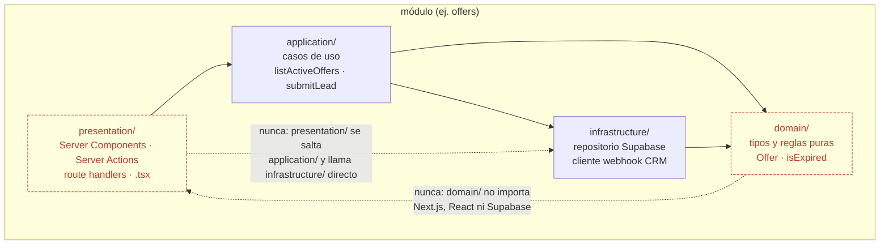
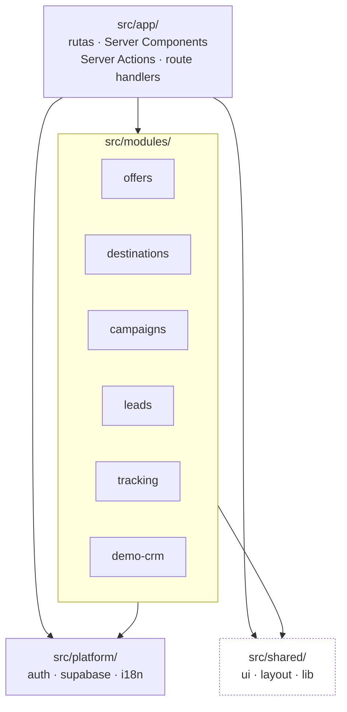
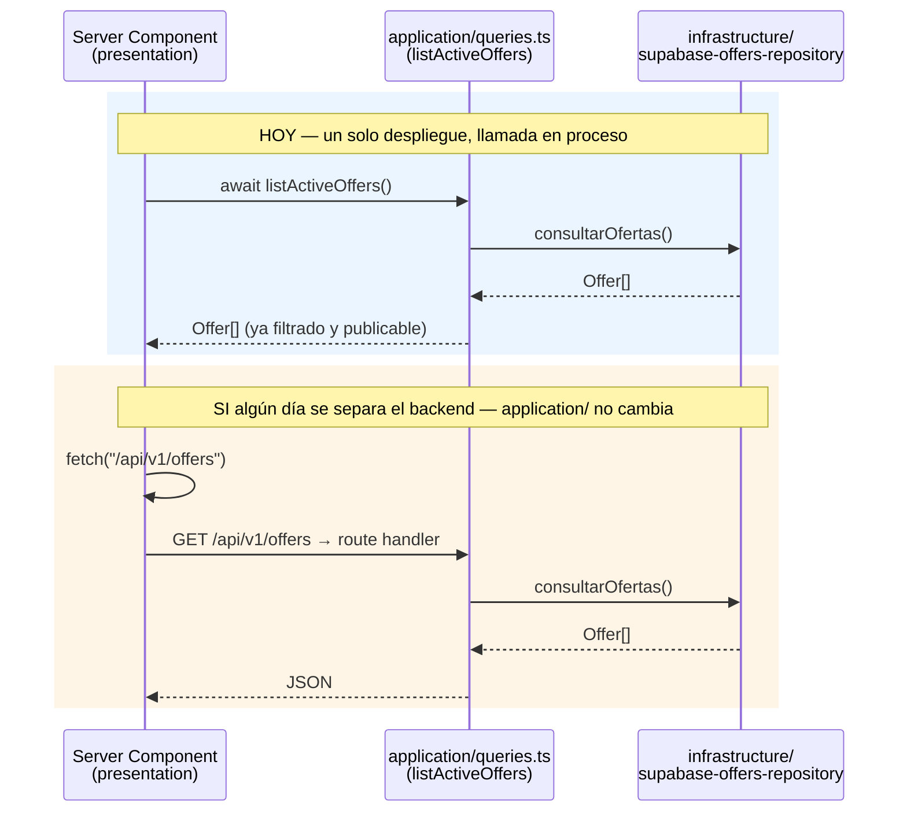

# Arquitectura objetivo: module-first, en `src/`, lista para REST

> Diseño objetivo, no ejecución. Ningún archivo se mueve por escribir este documento. Explica
> **hacia dónde** migra el código y **con qué regla**, para que cada PR futuro (empezando por el
> siguiente paso de `plan-fase-1.md`/`plan-backoffice.md`) pueda moverse un poco en esta dirección
> sin que nadie tenga que rediseñar sobre la marcha. La foto de dónde está el código hoy y por qué
> esto hace falta vive en [`mapeo-arquitectura-actual.md`](mapeo-arquitectura-actual.md). Las
> decisiones que este documento asume como ya tomadas están en los ADR de esta misma carpeta
> (índice en [`README.md`](README.md)) — este texto es el "cómo se ve", los ADR son el "por qué se
> decidió así".

## 1. Los tres principios, en una frase cada uno

- **Module-first**: la carpeta de primer nivel bajo `src/` es una capacidad de negocio
  (`offers`, `destinations`, `leads`...), no un tipo de archivo (`components`, `lib`). Dentro de
  cada módulo sí hay carpetas por tipo — pero acotadas a ese módulo.
- **Regla de dependencia** (Clean Architecture, sin nombres de libro): el dominio no sabe que
  existe Next.js ni Supabase; la aplicación orquesta el dominio; la infraestructura y la
  presentación dependen de la aplicación, nunca al revés. Es la misma regla que
  `plan-backoffice.md` §2.2 ya escribió para `lib/admin/**` ("no importa nada de `app/`"),
  generalizada a todos los módulos.
- **REST-ready**: la capa de aplicación de cada módulo son funciones puras de casos de uso
  (`listActiveOffers`, `submitLead`, `publishOffer`) sin firma de HTTP ni de Next.js. Hoy la
  presentación las llama **en proceso** (una función). El día que haga falta un backend
  independiente, se envuelven en handlers REST sin tocarlas — ver §5.

Sin sobre-ingeniería quiere decir: no hay `ports`/`adapters` con interfaces para todo, no hay
inyección de dependencias genérica, no hay una capa por módulo si el módulo es trivial (`demo-crm`
colapsa `domain`+`application` en un archivo — ver §4). Se aplican las cuatro carpetas donde el
módulo ya tiene, o va a tener pronto, más de un consumidor o más de un origen de datos — que es
exactamente el caso que `offers`/`destinations`/`admin` ya viven hoy.

**La regla de dependencia, en un diagrama** — las flechas son de import; solo pueden apuntar hacia
adentro, nunca al revés:



`domain/` no tiene ninguna flecha de salida (es la hoja del grafo): no importa `application/`,
`infrastructure/` ni `presentation/`, ni de su propio módulo ni de otro. `application/` sí importa
`infrastructure/` — necesita llamar al repositorio para poder implementar un caso de uso (ver el
diagrama de secuencia en §5: `App` llama a `Repo`) — y ninguna de las dos importa nada de
`presentation/`. Es literalmente lo que hoy rompe `app/api/lead/route.ts` (mezcla las cuatro cajas
en un archivo) y lo que ADR-0002 corrige.

> **Corrección 2026-09-15:** la versión anterior de este diagrama dibujaba `INFRA --> APP`
> (infraestructura importando aplicación) y ADR-0002 describía la cadena como
> `presentation/ → infrastructure/ → application/ → domain/`. Los dos eran incompatibles con el
> propio diagrama de secuencia de §5, donde `application/` llama al repositorio — es decir,
> `application/` importa `infrastructure/`, no al revés. Corregido en ambos documentos; las cuatro
> reglas de `.dependency-cruiser.mjs` (ver ADR-0002 "Consecuencias") verifican esta dirección en
> cada build, no solo el texto.

## 2. Árbol objetivo

Vista de dependencias entre las cuatro zonas de `src/` (el árbol de carpetas completo está debajo
del diagrama). `app/` es la única que puede depender de todo; `shared/` no depende de nada del
proyecto:



`shared/` no importa nada de `modules/` ni de `platform/` (por eso su borde es punteado): si un
componente de `shared/ui` necesitara saber qué es una oferta, dejaría de ser genérico y tendría que
mudarse al módulo correspondiente — es el mismo criterio de la tabla en §4.

```
src/
  app/                          → App Router (idéntico a hoy, solo se mueve)
    [locale]/(sitio)/...        →   rutas públicas: SEGMENTOS EN ESPAÑOL (ver ADR-0004)
    admin/...                   →   panel: segmentos en inglés (no indexado, sin valor SEO)
    api/...                     →   route handlers = adaptadores REST delgados
    globals.css · sitemap.ts · robots.ts
  proxy.ts                      → detección de locale (Next.js exige que viva junto a `app/`)

  modules/
    offers/
      domain/
        offer.ts                → Offer, OfferLookup, Coleccion, isExpired, isPublishable
                                   (hoy lib/types/offer.ts)
      application/
        queries.ts              → listActiveOffers, listOffersByCollection, listOfferSlugs,
                                   getOffer, getOfferById (hoy lib/offers/index.ts)
        commands.ts              → createDraft, updateOffer, publish, expire, reorder
                                   (hoy lib/admin/ofertas.ts)
        fields.ts                → parsearCamposOferta y sus tipos (hoy lib/admin/campos.ts, solo la
                                   parte específica de oferta — ver nota de `campos.ts` al pie del
                                   árbol: los helpers genéricos que usaba este archivo se van a
                                   `shared/lib/form-data.ts`, no se duplican aquí)
      infrastructure/
        supabase-offers-repository.ts   → el SELECT + `filaAOferta()` (hoy repartidos entre
                                   lib/offers/index.ts y lib/supabase/mapeo.ts)
        revalidate.ts             → qué rutas caduca una oferta (hoy lib/admin/revalidar.ts,
                                   la parte de oferta)
      presentation/
        components/              → OfferGallery, StickyCta, ExpiredRateNotice, PriceDisclosure
                                   (hoy components/oferta/* + components/ui/price-disclosure.tsx —
                                   este último se muda aquí, ver §4)
        admin/                   → OfferFields (formulario compartido crear/editar), listado, alta,
                                   edición, fotos, publicar, secciones (hoy app/admin/ofertas/**,
                                   11 archivos)

    destinations/
      domain/
        destination.ts           → Destination, DestinationCategory, slugs reservados
                                   (hoy lib/types/destination.ts + lib/destinations/categorias.ts)
      application/
        queries.ts               → listDestinations, listDestinationsByCategory,
                                   listFeaturedDestinations, getDestination, getCategoriasPorSlug,
                                   listOffersForDestination, getDestinationFromPrice
                                   (hoy lib/destinations/index.ts — las dos últimas ya cruzan con
                                   `offers/application`, es una dependencia entre módulos válida,
                                   ver nota debajo del árbol)
        commands.ts               → create/update destino, reorder (hoy lib/admin/destinos.ts)
        fields.ts                 → parsearCamposDestino, validarNombreDestino y sus tipos (hoy
                                   lib/admin/campos.ts, solo la parte específica de destino — misma
                                   nota que en `offers/application/fields.ts`, ver pie del árbol)
      infrastructure/
        supabase-destinations-repository.ts   → el SELECT + `filaADestino()` (hoy repartidos entre
                                   lib/destinations/index.ts y lib/supabase/mapeo.ts)
      presentation/
        components/               → CategoryList, CategoryFilter (hoy
                                   components/destinos/listado-categoria.tsx y
                                   components/ui/filtro-categoria.tsx — este último se muda aquí)
        admin/                    → DestinationFields, listado, alta, edición (hoy
                                   app/admin/destinos/**)

    campaigns/
      domain/
        campaign.ts               → Campaign, CampaignLookup (hoy lib/types/campaign.ts)
      application/
        queries.ts                → listCampaignSlugs, getCampaign — cruza con
                                   `offers/application.getOfferById` para saber si la tarifa de la
                                   landing venció (hoy lib/campaigns/index.ts)
      infrastructure/
        mock-campaigns-repository.ts   → **todavía no migrado a Supabase** (a diferencia de offers/
                                   destinations): hoy `MOCK_CAMPAIGNS` en lib/mock/campaigns.ts sigue
                                   siendo la fuente real, no un seed en desuso — ver nota debajo
      presentation/
        [locale]/lp/[campana]/     → hoy app/[locale]/lp (se queda en app/, importa de este módulo)

    leads/
      domain/
        lead.ts                   → LeadPayload, LeadContact, LeadOpportunity, LeadAttribution,
                                   ConsentRecord, reglas de consentimiento (hoy lib/crm/index.ts +
                                   lib/consent/index.ts — nombres de propiedad en inglés, ver ADR-0004)
      application/
        submit-lead.ts            → valida, arma el registro de consentimiento, normaliza teléfono,
                                   genera eventId/externalId, delega en el repositorio de CRM (hoy
                                   repartido dentro de app/api/lead/route.ts — es exactamente el
                                   acoplamiento que corrige ADR-0002)
      infrastructure/
        crm-webhook-client.ts      → sendLeadToCrm, toE164 (hoy lib/crm/index.ts)
        consent-record.ts          → buildConsentRecord, POLICY_VERSION (hoy lib/consent/index.ts)
      presentation/
        components/                → LeadForm, TrackLead (hoy components/forms/*)
        api/lead/route.ts          → adaptador HTTP delgado: parsea el body, llama a
                                   `submit-lead`, traduce el resultado a status HTTP (hoy
                                   app/api/lead/route.ts, con la lógica ya movida a application/)

    tracking/
      domain/
        consent-state.ts           → ConsentState, CONSENT_DENEGADO/CONCEDIDO, LeadContext (hoy
                                   lib/tracking/consent.ts + parte de lib/tracking/events.ts —
                                   consentimiento de COOKIES, no confundir con `leads` §Ley 1581)
      application/
        events.ts                  → trackWhatsAppClick, trackLead, trackViewContent, createEventId,
                                   createExternalId (hoy lib/tracking/events.ts)
      infrastructure/
        pixels-client.ts           → carga de GA4/Meta/TikTok, `emitirEvento` (hoy
                                   lib/tracking/analytics.ts)
        consent-storage.ts          → leerConsentimiento/guardarConsentimiento en localStorage (hoy
                                   parte de lib/tracking/consent.ts)
        utm-storage.ts               → capturarUtm/leerUtm en sessionStorage (hoy lib/tracking/utm.ts)
      presentation/
        components/                 → CookieBanner (se muda de shared/layout, es consentimiento de
                                   cookies, no layout genérico), UtmCapture (se muda de
                                   components/campana/captura-utm.tsx — captura UTMs para
                                   atribución, no es específico de campaña aunque hoy viva ahí;
                                   `campaigns/presentation` lo importa desde `tracking`, ver nota)

    demo-crm/                      → módulo autocontenido, capas colapsadas por ser una demo interna
      application.ts                → guion + respuestas (hoy lib/demo-crm/{guion,respuestas}.ts)
      infrastructure/
        respuestas.json             → semilla propia del módulo (hoy data/demo-crm-respuestas.json)
      presentation/
        components/                 → ResponseField (hoy components/demo-crm/campo-respuesta.tsx)
        api/respuestas/route.ts     → hoy app/api/demo-crm/respuestas/route.ts

  platform/                       → infraestructura técnica transversal, sin reglas de negocio
    admin/
      admin-shell.tsx               → el header/nav/superficie del panel (hoy app/admin/layout.tsx
                                   — layout.tsx en sí no se mueve hasta el paso atómico, pero su
                                   contenido no-ruta se extrae aquí, ver ADR-0001/ADR-0005 regla 6)
      piezas.tsx                    → componentes sueltos del panel sin módulo propio (hoy
                                   app/admin/piezas.tsx: no es un archivo de ruta, así que migra
                                   completo, no se extrae)
    auth/
      session.ts                   → exigirSesion, entrar, salir, olvideClave, restablecerClave
                                   (hoy app/admin/acciones/sesion.ts — es "use server", pero no
                                   decide nada de negocio: solo abre/cierra sesión de Supabase Auth)
    supabase/
      server-client.ts · browser-client.ts   → hoy lib/supabase/{admin,client}.ts
      database.types.ts             → hoy lib/supabase/database.types.ts
      column-allowlist.ts            → hoy `COLUMNAS_OFERTA` en lib/supabase/client.ts
    i18n/
      routing.ts · navigation.ts · request.ts   → hoy lib/i18n/*
    config.ts                        → SITE_URL, WHATSAPP_NUMBER, RNT_NUMBER, NIT_NUMBER, CONTACT,
                                   buildWhatsAppUrl (hoy lib/config.ts — datos de sitio/legales, sin
                                   regla de negocio propia; se queda junto en un archivo por ser 5
                                   constantes y una función, separarlo sería sobre-ingeniería)

  shared/                          → reutilizable, sin significado de negocio
    ui/                             → Button, Input, Card, Badge, Accordion, Field, Section, Hero
                                   (hoy components/ui — MENOS price-disclosure, filtro-categoria
                                   y cookie-banner, que sí tienen significado de negocio y se mudan
                                   a sus módulos, ver §4)
    layout/                        → Navbar, Footer, LanguageSwitcher, WhatsAppFloating (hoy
                                   components/layout — MENOS CookieBanner, ver `tracking` arriba)
    lib/                            → cn(), FONT_SIZE_TOKENS, helpers genéricos (hoy lib/utils.ts)
                                   · form-data.ts → vacioANulo, aLista, aTexto, aSlug (hoy la mitad
                                   de lib/admin/campos.ts): conversión de FormData sin ningún
                                   conocimiento de "Oferta" ni "Destino" — hoy las usan además
                                   components/oferta/tarifa-vencida.tsx y dos páginas públicas, así
                                   que ya cruzaban la frontera de "solo admin" antes de este diseño

messages/                          → se queda donde está (convención de next-intl)
scripts/                           → generar-semilla.mts se queda en la raíz (script de
                                   mantenimiento, no código de aplicación); sigue leyendo
                                   `lib/mock/{offers,destinations}.ts`, que hoy solo él usa
public/ · package.json · next.config.ts · tsconfig.json · .env* · .nvmrc
                                → SE QUEDAN EN LA RAÍZ, Next.js lo exige (§6)
```

**Cinco aclaraciones que el árbol no puede mostrar por sí solo:**

- **Un módulo sí puede importar la `application/` de otro módulo.** La regla de dependencia (§1) es
  sobre capas *dentro* de un módulo, no una prohibición de que `destinations` use
  `offers.application.listActiveOffers` (para calcular el precio "desde") o que `campaigns` use
  `offers.application.getOfferById` (para saber si la tarifa de la landing venció) — ambas
  dependencias ya existen hoy en `lib/destinations/index.ts` y `lib/campaigns/index.ts` y son
  correctas: van de un módulo hacia la `application/` de otro, nunca hacia su `infrastructure/`.
  Lo que sí está prohibido es que `offers/domain` importe algo de `destinations` — eso convertiría
  dos módulos independientes en uno solo disfrazado de dos carpetas.
- **Esa dependencia entre módulos no puede formar un ciclo.** Hoy el sentido es siempre
  `destinations → offers` y `campaigns → offers`/`campaigns → tracking`: un grafo, no una red. Si en
  algún momento `offers/application` necesitara algo de `destinations` (ej. un cálculo que cruce
  ambos), **no** se agrega el import inverso — eso crea `offers → destinations → offers`, que es
  exactamente el acoplamiento que el diseño module-first existe para evitar. La resolución es
  extraer el concepto compartido a un módulo nuevo del que ambos dependan (ej. un `modules/pricing/`
  si el cálculo cruzado deja de ser un caso aislado). **Esto ya no se revisa a ojo**: `pnpm
  check:deps` (`.dependency-cruiser.mjs`, corre dentro de `pnpm check` → `pnpm build`) tiene una
  regla `no-circular` que falla el build ante cualquier ciclo dentro de `src/`, y una regla
  `no-cross-module-internals` que además bloquea que un módulo importe la `domain/`,
  `infrastructure/` o `presentation/` de otro (solo su `application/` es alcanzable desde afuera).
  Se decidió no esperar a que "el número de módulos deje de ser obvio a ojo" — el mismo argumento de
  ADR-0002 para no diferir el lint de framework: el código de este repo también lo escriben flujos
  automatizados, y un ciclo entrando en un PR aprobado por un agente no es más detectable a ojo que
  uno aprobado por una persona.
- **`campaigns` es el único módulo que hoy NO lee de Supabase.** `lib/mock/campaigns.ts` no es un
  seed abandonado como `lib/mock/{offers,destinations}.ts` (esos dos solo los usa
  `scripts/generar-semilla.mts`) — es la fuente de datos real que consulta `lib/campaigns/index.ts`
  en producción. La migración de `campaigns` a Supabase, si llega, es un cambio de
  `infrastructure/mock-campaigns-repository.ts` a un `supabase-campaigns-repository.ts`; nada en
  `domain/` ni en `application/` se entera.
- **`lib/admin/campos.ts` no es en realidad un archivo compartido entre `offers` y `destinations` —
  solo parecía serlo.** Tiene tres partes distintas: `parsearCamposOferta` (tipos y validación 100%
  de oferta), `parsearCamposDestino` + `validarNombreDestino` (100% de destino, esta última además
  depende de `SLUGS_RESERVADOS` de `destinations/categorias`), y cuatro funciones sin ningún
  conocimiento de negocio — `vacioANulo`, `aLista`, `aTexto`, `aSlug` — que las dos primeras usan
  como utilería. Separado así, no hay nada que compartir entre `offers/application/fields.ts` y
  `destinations/application/fields.ts`: cada uno se queda con su propia validación, sin duplicar
  nada, porque las reglas nunca fueron las mismas 13 columnas de oferta no son las 5 de destino. Lo
  único que de verdad se reutiliza son las cuatro funciones genéricas, que van a
  `shared/lib/form-data.ts` (§2, entrada `shared/lib/`). Consecuencia: ni `offers` ni `destinations`
  importan la `application/` del otro por este motivo — ambos importan `shared/lib`, que es
  precisamente el tipo de dependencia que `shared/` existe para servir.
- **`platform/admin/` es el shell transversal del panel, no un módulo de negocio** (ratificado
  2026-09-18, cerraba una decisión abierta que `docs/brand/specs/grafo.md` §7 dejó pendiente al
  construir el grafo de ejecución de las fases de marca). `app/admin/layout.tsx` y
  `app/admin/piezas.tsx` no tienen reglas de negocio propias — son infraestructura de UI que
  `offers/presentation/admin/` y `destinations/presentation/admin/` comparten, así que el criterio
  de §4 de este documento ("¿es infraestructura técnica que varios módulos usan pero que no decide
  nada de negocio?") los coloca en `platform/`, no en un módulo nuevo. Si en el futuro un tercer
  módulo con panel admin (`leads`, `tracking`) necesita el mismo shell, confirma que la ubicación
  fue correcta; si en cambio empieza a acumular lógica específica de un solo módulo, esa lógica se
  extrae de vuelta al módulo, no se queda en `platform/`.

## 3. Anatomía de un módulo — y cuándo se colapsa

Las cuatro carpetas (`domain/application/infrastructure/presentation`) son el techo, no el piso
obligatorio. Regla de decisión:

- **Si el módulo tiene un solo origen de datos y un solo consumidor** (caso `demo-crm`, hoy 3
  archivos en total), `domain` y `application` colapsan en un único `application.ts` — separar en
  cuatro carpetas ahí sería la sobre-ingeniería que el pedido explícitamente quiere evitar. El
  momento de dejar de estar colapsado no es un juicio que se revise cada vez a mano: si
  `application.ts` (o `domain.ts`) supera 60 líneas, `pnpm lint` falla (`max-lines` en
  `eslint.config.mjs`, `files: ["src/modules/*/application.ts", "src/modules/*/domain.ts"]`) — el
  mismo criterio numérico que `plan-backoffice.md` §2.2 ya usa para Server Actions (~25 líneas),
  ajustado hacia arriba porque aquí se fusionan dos capas, no una.
- **Si el módulo ya tiene lectura pública + escritura admin** (`offers`, `destinations`), las cuatro
  carpetas ganan su costo de inmediato: es literalmente la estructura que `plan-backoffice.md` §2.2
  ya recomendó para evitar las cuatro duplicaciones que identificó (formulario repetido, parseo de
  `FormData` repetido, rutas a revalidar repetidas, intercambio de `orden` repetido).
- **`infrastructure/` implementa, no decide.** Un repositorio de Supabase no contiene la regla
  "una tarifa vencida no se cae, se muestra vencida" (eso es `domain`); solo sabe hacer el `SELECT`
  y mapear la fila. Si mañana la base de ofertas se muda a un sistema externo (`spec-tecnica.md`
  §7 checklist, punto 4, todavía abierto), solo cambia este archivo.
- **`presentation/` es lo único que puede importar Next.js/React.** Server Components, Server
  Actions, *route handlers*, componentes `.tsx`. Nunca al revés: `domain/` y `application/` no
  importan `next/server`, `next/headers` ni tipos de Supabase — eso es justamente lo que hoy rompe
  `app/api/lead/route.ts` (ver `mapeo-arquitectura-actual.md` §3) y lo que este árbol corrige.

## 4. Módulos vs. `platform/` vs. `shared/` — cómo distinguirlos

| Pregunta | Si la respuesta es sí → |
|---|---|
| ¿Tiene reglas de negocio propias (una oferta vencida se comporta distinto a una vigente)? | `modules/` |
| ¿Es infraestructura técnica que varios módulos usan pero que no decide nada de negocio (cómo se abre una sesión, cómo se conecta a Supabase)? | `platform/` |
| ¿Es UI o utilidades genéricas sin significado de negocio (un botón, `cn()`)? | `shared/` |

Ejemplo del error que este criterio evita: `components/ui/price-disclosure.tsx` y
`components/ui/filtro-categoria.tsx` viven hoy en `ui/` (que sugiere "genérico"), pero el primero
implementa una regla de negocio explícita (`spec-tecnica.md` §8.4: qué campos son obligatorios
junto al precio) y el segundo es específico de la taxonomía de destinos. Ambos se mudan a
`presentation/` de su módulo (`offers` y `destinations` respectivamente) — no porque estén mal
escritos, sino porque su ubicación actual no refleja de qué dominio dependen.

El mismo error, en la otra dirección, aparece con `components/layout/cookie-banner.tsx` y
`components/campana/captura-utm.tsx`: el primero vive en `layout/` (que sugiere "chrome del sitio")
pero es consentimiento de cookies — se muda a `tracking/presentation`. El segundo vive en
`campana/` (que sugiere "solo para campañas") pero captura atribución para cualquier página, no
solo landings — también se muda a `tracking/presentation`, y `campaigns/presentation` lo consume
desde ahí (la nota al pie del árbol en §2 explica por qué un módulo sí puede depender de otro).

## 5. Frontera REST: cómo se prepara sin construirla antes de tiempo

Hoy `listActiveOffers()` es una función que un Server Component llama directamente, en el mismo
proceso — cero red, cero latencia extra, y así debe seguir mientras el frontend y el "backend" son
el mismo despliegue de Next.js. Lo que cambia con este diseño es **dónde** vive esa función: en
`modules/offers/application/queries.ts`, sin ningún import de Next.js. Eso es lo único que hace
falta para que, el día que el roadmap lo pida, envolverla sea mecánico:

```ts
// src/modules/offers/presentation/api/route.ts — SOLO si/cuando haga falta un backend separado
import { listActiveOffers } from "@/modules/offers/application/queries";

export async function GET() {
  return Response.json(await listActiveOffers());
}
```

`listActiveOffers` no cambia una línea. Lo que cambiaría, en el frontend, es reemplazar la llamada
directa por un `fetch("/api/v1/offers")` — un cambio contenido en la capa de presentación del
consumidor, no en el dominio. Ese es el valor concreto de la regla de dependencia: no es dogma
arquitectónico, es la diferencia entre "cambiar un archivo" y "reescribir el módulo" cuando el
proyecto llegue a ese punto.



El único tramo que cambia es el segundo escenario, y solo en `presentation/` (cómo `Page` obtiene
el dato); `application/` e `infrastructure/` son idénticos en los dos.

**Convención REST para lo que ya es HTTP hoy** (`/api/lead`, y lo que sume Fase 2 —
`/api/meta-capi`, `/api/tiktok-events` según `spec-tecnica.md` §5): recurso en la URL, verbo HTTP
como acción, códigos de estado explícitos (ya se hace: 400/422/502 en `app/api/lead/route.ts`), y
versionado desde el primer endpoint nuevo que se agregue (`/api/v1/...`) — no hace falta
versionar `/api/lead` retroactivamente, pero todo endpoint nuevo nace versionado. Nada de HATEOAS,
nada de generación de OpenAPI: eso sí sería sobre-ingeniería para el tamaño actual del proyecto.

## 6. Lo que Next.js exige y lo que no se toca

Verificado contra `node_modules/next/dist/docs/01-app/01-getting-started/02-project-structure.md`
y `.../file-conventions/src-folder.md`:

- Mover `app/` a `src/app/` es soporte nativo: Next.js lo detecta solo, y **ignora** un `app/` en
  la raíz si `src/app/` existe — no puede convivir uno de cada.
- `proxy.ts` **debe** vivir junto a `app/`: si `app/` se muda a `src/app/`, `proxy.ts` se muda a
  `src/proxy.ts`.
- `public/`, `package.json`, `next.config.ts`, `tsconfig.json` y `.env*` **se quedan en la raíz**
  — Next.js lo exige explícitamente, no es una preferencia de este documento.
- El alias `@/*` (hoy `"@/*": ["./*"]` en `tsconfig.json`, usado en 103 archivos) pasa a
  `"@/*": ["./src/*"]`. Es el único cambio de configuración que exige la mudanza — no hace falta
  tocar Tailwind (v4 no tiene `tailwind.config.js` que actualizar, los tokens ya viven en
  `app/globals.css` vía `@theme`).
- `messages/` (next-intl) puede quedarse en la raíz o entrar a `src/`; este diseño lo deja en la
  raíz por ser datos de contenido, no código, coherente con cómo ya se trata `public/`.

## 7. Qué NO cambia con este documento

Ninguna URL pública cambia (`/destinos/...`, `/ofertas/...` siguen en español, ver ADR-0004).
Ningún componente cambia de comportamiento. Esto es reorganización de carpetas y nombres, ejecutada
de forma incremental (ADR-0005) — no una reescritura. El criterio de "no romper nada" se verifica
igual que en `plan-backoffice.md` Fase 0: `pnpm build` en `EXIT=0` y el recorrido completo de cada
módulo migrado probado en navegador antes de mergear su PR.
