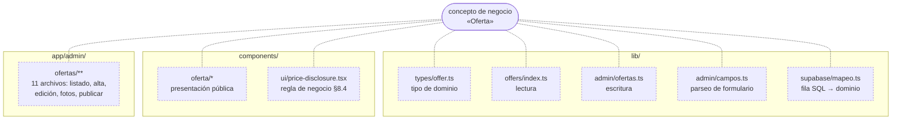

# Mapeo de la arquitectura actual

> **Qué es esto.** Una foto del código tal como está hoy (2026-09-15), para servir de línea base al
> nuevo diseño en [`arquitectura-modular.md`](arquitectura-modular.md) y a los ADR de esta misma
> carpeta (índice en [`README.md`](README.md)). No es una crítica de lo construido — el sitio
> funciona y `spec-tecnica.md` se siguió con disciplina — es un inventario de **qué patrón de
> organización hay realmente**,
> para no diseñar el paso siguiente sobre una foto imaginada del repo.

## 1. Qué dice `spec-tecnica.md` §5 vs. qué hay en el código

`spec-tecnica.md` §5 propone `app/`, `components/{ui,sections,layout}/`, `lib/{i18n,cms,offers,crm,consent,tracking}/`. Eso es una organización **por tipo técnico** (páginas / componentes / lógica), no por capacidad de negocio. El código la seleció con fidelidad y la extendió: hoy hay 8 subcarpetas en `lib/` (`admin`, `campaigns`, `consent`, `crm`, `demo-crm`, `destinations`, `i18n`, `mock`, `offers`, `supabase`, `tracking`, `types`) y 6 en `components/` (`campana`, `demo-crm`, `destinos`, `forms`, `layout`, `oferta`, `ui`). Es más grano del que proponía el spec, pero sigue siendo **layer-first**: el eje de carpetas es "esto es una página", "esto es un componente", "esto es lógica de datos", no "esto es todo lo relativo a una oferta".

Consecuencia concreta: el concepto **Oferta** (`Offer`) vive repartido en al menos siete sitios sin una carpeta que lo agrupe:

| Pieza de "Oferta" | Archivo |
|---|---|
| Tipo de dominio | `lib/types/offer.ts` |
| Lectura (una sola puerta) | `lib/offers/index.ts` |
| Escritura (crear/publicar/vencer) | `lib/admin/ofertas.ts` |
| Parseo de formulario | `lib/admin/campos.ts` (compartido con Destino) |
| Mapeo fila SQL → dominio | `lib/supabase/mapeo.ts` |
| Presentación pública | `components/oferta/{galeria,sticky-cta,tarifa-vencida}.tsx`, `components/ui/price-disclosure.tsx` |
| Presentación admin | `app/admin/ofertas/**` (11 archivos: listado, alta, edición, fotos, publicar, secciones) |

Ninguna carpeta agrupa estas siete piezas: para tocar "todo lo que es Oferta" hoy hay que conocer de memoria esta tabla. Lo mismo aplica, en menor escala, a **Destino** y a **Lead** (repartido entre `app/api/lead/route.ts`, `lib/consent/`, `lib/crm/`, `lib/tracking/events.ts`, `components/forms/`).

Ningún nodo del diagrama tiene una arista sólida hacia otro: son siete implementaciones del mismo
concepto que solo se conectan a través del propio concepto de negocio, no de una carpeta compartida.
`arquitectura-modular.md` §2-3 propone la carpeta que falta (`src/modules/offers/`) y dónde va cada
pieza de esta misma tabla.

## 2. Lo que ya funciona y hay que conservar, no rehacer

- **El patrón "una sola puerta"** (`lib/offers/index.ts`, `lib/destinations/index.ts`) ya aplica, de facto, la regla de dependencia de Clean Architecture: ninguna página consulta Supabase directamente, todas pasan por estas funciones. Es la prueba de que el patrón migró sin tocar una sola página cuando `lib/mock/` se reemplazó por Supabase (`CLAUDE.md`, `CURRENT.md`).
- **`plan-backoffice.md` §2 ya identificó el mismo problema del lado de escritura** (`app/admin/acciones.ts` como monolito de 310 líneas) y ya lo resolvió con una regla explícita: *"Una Server Action no contiene reglas de negocio... si crece más de ~25 líneas, la regla se fue al archivo equivocado"* y *"`lib/admin/**` no importa nada de `app/`"*. Esa es, literalmente, la regla de dependencia de Clean Architecture aplicada sin nombrarla así. El diseño nuevo no inventa este principio: lo generaliza a todos los módulos.
- **RLS + `COLUMNAS_OFERTA`** ya actúan como invariantes de dominio reforzados en la infraestructura (un borrador no puede salir de la base aunque el código lo pidiera).

## 3. Dónde el acoplamiento ya se filtró a la capa equivocada

`app/api/lead/route.ts` es el ejemplo más claro: el *route handler* (capa de presentación/adaptador HTTP) contiene directamente la regla de negocio "sin consentimiento explícito no hay lead que capturar" (línea 48), la validación de campos obligatorios (línea 58) y arma el payload de dominio a mano (líneas 81-108), todo antes de delegar a `sendLeadToCrm`. Si mañana este mismo flujo tuviera que exponerse también como acción de servidor desde un formulario embebido, o migrar a un backend separado, esa regla de negocio se reescribiría o se duplicaría en el segundo punto de entrada — exactamente el riesgo que `plan-backoffice.md` ya evitó para ofertas/destinos, pero que en `leads` no está resuelto todavía.

## 4. Mezcla de idioma, en dos niveles distintos

**Nivel carpeta/archivo** — sin regla, mitad y mitad:

| Español | Inglés |
|---|---|
| `components/campana/`, `components/destinos/`, `components/oferta/` | `lib/offers/`, `lib/destinations/`, `lib/campaigns/`, `lib/crm/`, `lib/consent/`, `lib/tracking/` |
| `app/admin/acciones/`, `app/admin/entrar/`, `app/admin/olvide/`, `app/admin/restablecer/`, `app/admin/piezas.tsx` | `lib/types/`, `lib/mock/`, `lib/supabase/` |
| `lib/admin/campos.ts`, `lib/admin/revalidar.ts`, `lib/admin/orden.ts`, `lib/admin/ofertas.ts`, `lib/admin/destinos.ts` | — |
| `lib/demo-crm/guion.ts`, `lib/demo-crm/respuestas.ts` | `lib/demo-crm/` (el nombre del módulo sí) |

**Nivel identificador, más profundo y menos visible** — incluso dentro de módulos con nombre en inglés, los tipos y propiedades están en español: `LeadContact.{nombre, telefono, ciudadOrigen}`, `LeadOpportunity.{destino, fechaAproximada, viajeros}`, `LeadPayload.{contacto, oportunidad, atribucion, consentimiento}` (`lib/crm/index.ts`), `Offer.{destino, ciudadOrigen, ocupacionBase, precioDesde, vigenciaHasta, validadaEl}` (`lib/types/offer.ts`, ver también `spec-tecnica.md` §8.4). Esto importa más que el nombre de archivo: es lo que hay que decidir con cuidado en el ADR de idioma, porque **el mismo objeto `LeadPayload` se serializa tal cual con `JSON.stringify()` hacia el webhook de GoHighLevel** (`lib/crm/index.ts` línea ~104-108). Si se renombran las propiedades a inglés sin pensar en la frontera, se cambia también el contrato externo con el CRM — que hoy está documentado en español en `spec-tecnica.md` §8.2 y **todavía no está cerrado por escrito con NextGen** (§7 checklist, punto 5). Ver ADR-0004 §"La frontera no es el archivo, es el wire format".

## 5. Riesgo de escalar tal cual (por qué esto no es cosmético)

- **El acoplamiento a Next.js/Supabase está esparcido, no contenido.** `headers()`, `NextResponse` y el armado del payload de CRM conviven en el mismo archivo que la regla de consentimiento. Migrar a un backend independiente (el objetivo declarado a largo plazo) hoy exigiría releer cada *route handler* para separar "esto es HTTP" de "esto es negocio", módulo por módulo, sin una convención que lo prevenga.
- **La regla de "Server Action delgada" solo se aplicó donde dolió (ofertas/destinos admin).** Sin una capa `application/` nombrada igual en todos los módulos, el próximo módulo que crezca (`leads`, `tracking`) puede repetir el monolito de 310 líneas que `plan-backoffice.md` ya tuvo que desarmar una vez.
- **No hay convención REST**, ni siquiera para lo que ya es HTTP (`/api/lead`, `/api/demo-crm/respuestas`): sin versionado, sin un layout de `application/` reutilizable si se agrega `/api/meta-capi` o `/api/tiktok-events` en Fase 2 (`spec-tecnica.md` §5).
- **`src/` no existe.** Todo el código convive con la configuración de proyecto en la raíz (103 archivos usan el alias `@/*` → raíz). Next.js soporta mover `app/`, `components/`, `lib/` a `src/` de forma nativa (`node_modules/next/dist/docs/.../src-folder.md`): es la base mecánica sobre la que se apoya el diseño modular sin reescribir nada de lógica.

## 6. Conclusión: qué falta no es reescribir

El proyecto ya tiene, en dos módulos, el instinto correcto (una puerta de lectura, una capa de escritura sin JSX, Server Actions delgadas). Lo que falta es:

1. Nombrar y mover a `src/` con un eje **por capacidad de negocio**, no por tipo de archivo.
2. Generalizar la capa `application/` que ya existe de facto en `offers`/`admin` a `leads`, `consent`, `crm`, `tracking`, `campaigns`.
3. Declarar explícitamente la frontera entre "código" (inglés) y "contrato externo" (lo que exija el tercero — CRM, SEO), en vez de dejarlo implícito.

El diseño objetivo y el plan de adopción están en [`arquitectura-modular.md`](arquitectura-modular.md) y en los ADR de esta carpeta (índice en [`README.md`](README.md)).
