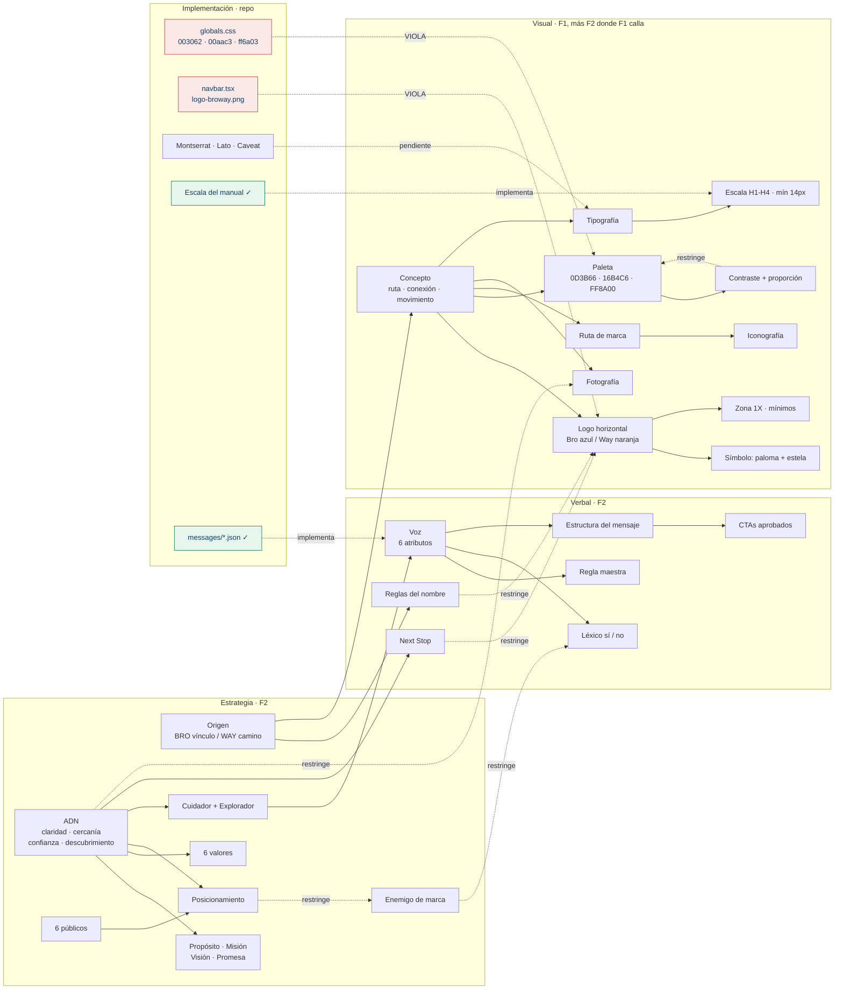

# Sistema de identidad — BroWay Adventures

> **Este documento es la fuente de verdad de la marca.** Reúne, cruza y resuelve las dos fuentes
> que el cliente entregó: el **manual vivo** (identidad visual vigente, incluido el logo real) y el
> **manual de marca v2.0** en PDF (identidad estratégica y verbal). Donde una página, un componente
> o un documento de `docs/` contradiga lo que aquí está escrito, **gana este documento** y lo otro
> se corrige.
>
> **Última verificación contra las fuentes:** 2026-09-10.
> **Estado:** vigente. Las contradicciones detectadas están en §5 con veredicto; lo que no se puede
> cerrar sin el cliente está en §8 — y está marcado como tal, no resuelto por conveniencia.

## Fuentes primarias

| # | Fuente | Alcance | Ubicación |
|---|---|---|---|
| **F1** | **Manual vivo** — «BroWay Adventures · Sistema de identidad», *Brand system 01.1*, 2026 | Identidad **visual**: logo real, variantes, paleta, tipografía, iconografía, fotografía, recursos, composición | `https://broway-manual-de-marca.miguelsuareh2.chatgpt.site/` · copia archivada en [`manual-vivo/`](manual-vivo/) |
| **F2** | **Manual de marca · Versión 2.0** (PDF, 27 páginas) | Identidad **estratégica**, **verbal** y **gobierno**; además especificación completa de color (HEX/RGB/CMYK), escala tipográfica, contraste, zona de seguridad y mínimos | [`manual-de-marca.pdf`](manual-de-marca.pdf) |

Las dos son del cliente y las dos son oficiales. No son la misma versión del mismo sistema: **F1
sustituyó el logo y la tipografía de F2, pero no reemplazó nada más** — F1 no habla de propósito,
valores, públicos, voz, tono, léxico ni gobierno, y F2 sigue siendo el único documento que los
define. De ahí la regla de precedencia de §0.1.

---

## 0. Cómo se usa este documento

### 0.1 Precedencia por materia (no por antigüedad)

| Materia | Manda | Por qué |
|---|---|---|
| Logo, símbolo, variantes de firma | **F1** | El cliente declaró el logo de F1 como el logo real de la empresa. El de F2 es la firma anterior |
| Familia tipográfica | **F1** | F1 declara Manrope; F2 declara Montserrat + Lato + Caveat. **Decidido el 2026-09-11 a favor de F1** (D-A, [`aprobaciones.md`](aprobaciones.md)) |
| Escala tipográfica, pesos, restricciones de uso | **F2** | F1 no da tamaños, interlineados ni mínimos; F2 sí, y son compatibles con cualquier familia |
| Paleta (azul, turquesa, naranja) | **F1 = F2** | Coinciden al dígito. No hay conflicto que resolver |
| Arena y gris | **F2** | Es la única que trae la especificación completa con CMYK (ver §5.4) |
| Contraste, proporción de color, reglas por color | **F2** | F1 no las trae — y las incumple en su propia página (§5.9) |
| Zona de seguridad y tamaños mínimos | **La más restrictiva de las dos** | Cumplir 1× de F1 cumple también el 0,5× de F2 (§5.5) |
| Iconografía y fotografía | **F2** como regla · **F1** como repertorio | Los archivos de F1 son ilustración generada, ni siquiera usan la paleta (§5.6) |
| ADN, propósito, misión, visión, promesa, valores, públicos, posicionamiento, arquetipos | **F2** | F1 no los menciona |
| Voz, tono, léxico, mensajes, CTAs, «Next Stop» | **F2** | F1 no los menciona |
| Nombre y su escritura | **F2** | F1 lo incumple en una pieza propia (§5.8) |
| Gobierno de marca y aprobaciones | **F2** | F1 no lo menciona |

### 0.2 Los principios inviolables

Doce reglas. No son preferencias de estilo: cada una tiene una fuente que la declara y una forma
mecánica de verificarla. Romper cualquiera es entregar trabajo defectuoso, no una variante.

| # | Principio | Fuente | Cómo se verifica |
|---|---|---|---|
| **P-1** | El nombre se escribe **BroWay Adventures**. «BroWay» es una sola unidad verbal con B y W en mayúscula. Prohibido *Bro Way*, *Broway*, *BROway*, *Bro-Way*, *BRO WAY* y abreviaturas improvisadas | F2 §02 | `grep -rnE "BRO WAY\|Bro Way\|Broway\|BROway\|Bro-Way"` sobre `messages/`, `app/`, `components/`, `lib/` → cero resultados |
| **P-2** | La firma **no se reconstruye ni se recolorea por pieza**: se usa el archivo maestro. No rotar, deformar, condensar, inclinar, añadir sombras, biseles, contornos, gradientes ni efectos 3D | F1 §01 · F2 §14 | Revisión visual; ningún CSS aplica `filter`, `transform: rotate/skew` ni `box-shadow` al `` del logo |
| **P-3** | **Nada se añade al logo.** Ni «Hermanos de aventuras», ni «Next Stop», ni un eslogan, ni una tagline de campaña | F2 §10 y §14 | El nodo del logo no tiene hermanos de texto dentro de su contenedor |
| **P-4** | Los colores de marca son exactamente **`#0D3B66`**, **`#16B4C6`**, **`#FF8A00`**, **`#F6E7C3`** y **`#F2F4F7`**. No se ajustan «a ojo» ni se derivan de una captura del logo | F1 §02 = F2 §15 | `grep` de hex en `app/globals.css` y `docs/`; cualquier otro valor de marca es un defecto |
| **P-5** | **Turquesa y naranja nunca sostienen texto pequeño sobre blanco** (2,51:1 y 2,36:1 medidos). Para texto pequeño, botones y datos críticos: azul o negro suave. Turquesa y naranja son **fondo** de acento con texto azul, o gráfico sin texto | F2 §16 y §17 | Matriz de §4.5.3; verificar **en el navegador**, contra la superficie real del componente |
| **P-6** | El **naranja no es color dominante**: se reserva para llamadas visuales, indicadores y puntos de atención. La proporción institucional orientativa es 40 % azul / 35 % neutrales / 12 % turquesa / 8 % naranja / 5 % arena | F2 §16 | Medición por superficie en la pieza terminada |
| **P-7** | **Una idea principal por composición y una sola ruta dominante.** Los nodos de la ruta marcan origen, decisión o destino — la ruta nunca es adorno | F1 §06 · F2 §22 | Conteo: una ruta por pieza, un foco por pieza |
| **P-8** | **Tamaño mínimo de texto: 14 px** en digital (9 pt impreso) e **interlineado mínimo 1,45** en cuerpo. Alineación a la izquierda, nunca justificado | F2 §19 | `--text-caption` = 14 px con `line-height` 1,45 en `app/globals.css` |
| **P-9** | **«Next Stop» es una firma narrativa, no un eslogan y no parte del logo**: máximo **una vez por pieza**, sin traducir dentro del identificador, sin combinarse con otras frases manuscritas | F2 §10 | Una sola aparición en el DOM por página (ya verificado en la home) |
| **P-10** | **No se promete lo que no se sostiene.** Prohibidas: «la mejor oferta» sin evidencia, «precio garantizado», «viaja sin preocupaciones», «cumplimos tus sueños», «últimos cupos» como recurso permanente, «te resolvemos todo», «financiamos» cuando no se otorga crédito, y el exceso de diminutivos o jerga | F2 §09 · F2 §06 (enemigo de marca) | `grep` del léxico prohibido sobre `messages/` y las páginas |
| **P-11** | **La voz no presiona.** Sin urgencia artificial, sin dramatizar, sin cuentas atrás inventadas. El tono se adapta a la situación; la voz no cambia | F2 §08 | Revisión de copy contra §3.1 antes de publicar |
| **P-12** | **Cambios al logo, al color, a la tipografía, al tono, al posicionamiento, a los eslóganes y a las submarcas requieren aprobación** de la dirección de marca. Este documento no los autoriza por sí solo | F2 §24 | §7: registro de aprobaciones |

---

## 1. El grafo de identidad

La marca se leyó como un grafo dirigido — **57 nodos** (decisiones de marca) y **70 aristas**
tipadas — porque las contradicciones entre dos manuales no se ven leyéndolos uno tras otro: se ven
cuando dos fuentes apuntan al mismo nodo con valores distintos. Tipos de arista: `define`
(36) · `restringe` (14) · `contradice` (9) · `viola` (6) · `implementa` (4) · `pendiente` (1).

El grafo contestó tres preguntas que a mano se contestan mal:

1. **¿Qué nodo tiene dos fuentes que dicen cosas distintas?** → 9 contradicciones, todas en §5.
2. **¿Qué implementación del repo desobedece un nodo?** → 6 violaciones, todas en §6.
3. **¿Qué nodo no tiene rastro en el código?** → el detalle está en §6.3.

Lo que el grafo hace evidente y la lectura lineal esconde: **la identidad verbal del repo está
bien y la visual está mal.** Las cinco aristas de implementación correcta salen de copy y escala
tipográfica; las seis violaciones se concentran en color y logo. No es un problema de criterio
editorial: es que los tokens de color se derivaron de una captura del logo en lugar de leer la
paleta, que ya venía especificada con HEX, RGB y CMYK.

---

## 2. Identidad estratégica *(F2)*

### 2.1 ADN de marca — la definición que orienta cualquier decisión creativa

> Una marca de viajes **cercana y confiable** que ayuda a las personas a **comprender sus
> opciones**, **elegir con mayor seguridad** y **sentirse acompañadas** en el camino hacia su
> próxima experiencia.

Cuatro pilares, en este orden:

| | Pilar | Significado operativo |
|---|---|---|
| 1 | **Claridad** | Explicar sin confundir |
| 2 | **Cercanía** | Tratar a cada persona como persona |
| 3 | **Confianza** | Respaldar cada mensaje con coherencia |
| 4 | **Descubrimiento** | Inspirar nuevas posibilidades |

> No se trata solamente de llegar a un destino. Se trata de sentir que alguien conoce el camino,
> explica las opciones y acompaña la decisión.

### 2.2 Origen y significado del nombre

La marca nació de una amistad entre sus dos fundadores que se convirtió en hermandad, sobre una
pasión compartida: viajar, descubrir lugares y ayudar a otras personas a vivir esas experiencias.
Fue concebida para **crecer más allá de sus fundadores** — poder ser representada por un equipo
sin perder la cercanía de su origen. *(Detalle e historia completa: F2 §02.)*

| Partícula | Significado | Rol en la identidad |
|---|---|---|
| **BRO** | Vínculo, confianza, complicidad y comunidad | La hermandad que dio origen a la marca |
| **WAY** | Camino, orientación, movimiento y próxima experiencia | La ruta que se comparte con cada viajero |

**Reglas del nombre → P-1.** Además: *«Hermanos de aventuras»* explica el origen, pero **no forma
parte del nombre ni del logo**.

### 2.3 Plataforma estratégica

| | Declaración |
|---|---|
| **Propósito** | Hacer que viajar se sienta más claro, cercano y posible para más personas. |
| **Misión** | Orientar y acompañar a viajeros en Colombia en la elección de experiencias nacionales e internacionales, mediante información comprensible, atención cercana y opciones ajustadas a sus necesidades. |
| **Visión** | Consolidar a BroWay Adventures como una marca de viajes reconocida en Colombia por la confianza que genera, la calidad de su orientación y la comunidad que construye. |
| **Promesa** | Te ayudamos a comprender tus opciones y a tomar tu próxima decisión de viaje con mayor confianza. |

### 2.4 Valores

| # | Valor | Definición |
|---|---|---|
| 1 | **Claridad** | Traducimos información compleja en mensajes fáciles de comprender |
| 2 | **Confianza** | La coherencia entre palabra, imagen y acción es irrenunciable |
| 3 | **Cercanía** | Escuchamos, orientamos y tratamos a cada persona con respeto |
| 4 | **Responsabilidad** | No prometemos aquello que no podemos sostener |
| 5 | **Curiosidad** | Exploramos destinos, alternativas y nuevas formas de viajar |
| 6 | **Consistencia** | La marca debe reconocerse sin importar el canal o la persona que la represente |

El valor 2 es el que convierte este documento en obligatorio: *la coherencia entre palabra, imagen
y acción es irrenunciable*. Un sitio que muestra un logo distinto al de la marca incumple un valor,
no una guía de estilo.

### 2.5 Públicos prioritarios

| Público | Qué necesita | Consecuencia para el sitio |
|---|---|---|
| **Parejas** | Conexión, celebración y decisiones compartidas | Contenido que se pueda mostrar a otra persona |
| **Familias** | Seguridad, organización y opciones comprensibles | Qué incluye / qué no, sin letra pequeña |
| **Jóvenes viajeros** | Novedad, flexibilidad, contenido visual y pertenencia | Peso visual y ritmo, sin perder claridad |
| **Viajeros frecuentes** | Rapidez, criterio y una marca que respete su experiencia | Cero pedagogía innecesaria; ir al dato |
| **Quienes planean pagos** | Claridad sobre fechas, condiciones y capacidad de planificación | Vigencia, condiciones y forma de pago visibles |
| **Primeros viajeros** | Pedagogía, reducción del miedo y acompañamiento sin juicio | Explicar el proceso, no solo el destino |

«Viajeros frecuentes» y «primeros viajeros» tiran en direcciones opuestas: ir al dato vs. explicar
el proceso. Se resuelve con jerarquía, no con promedio: el dato arriba, la explicación disponible
debajo.

### 2.6 Posicionamiento y enemigo de marca

> **Posicionamiento deseado:** «Con BroWay no recibo solamente una opción de viaje. Recibo claridad
> para elegir y una marca cercana que me acompaña en el camino.»

**Debe generar:** confianza inmediata · tranquilidad · cercanía · entusiasmo · sensación de
orientación · deseo de pertenecer a una comunidad viajera.

**Debe ser recordada por:** información clara · acompañamiento humano · estética limpia y
reconocible · contenido que orienta e inspira · la pregunta *«¿Cuál será tu Next Stop?»* · un
camino visual propio.

> **Enemigo de marca:** la improvisación, la presión comercial, la **saturación visual** y las
> promesas genéricas.

El enemigo está declarado y es operativo: *saturación visual* es el argumento por el que el diseño
respira, y *presión comercial* es el argumento por el que no hay cuentas atrás ni «últimos cupos»
permanentes.

### 2.7 Personalidad y arquetipos

| | Arquetipo | Cómo se expresa |
|---|---|---|
| **Principal** | **El Cuidador** | Protege, orienta y reduce la incertidumbre. Empatía, responsabilidad, explicación y atención |
| **Secundario** | **El Explorador** | Inspira libertad, curiosidad y descubrimiento. Evita que la marca se vuelva excesivamente institucional o fría |

> **Síntesis:** el compañero experto — una marca que camina al lado del viajero, entiende sus dudas
> y aporta criterio **sin imponer**.

Seis ejes, cada uno con su límite explícito:

| Es | No es |
|---|---|
| Cercana | informal |
| Profesional | corporativa |
| Experta | arrogante |
| Aventurera | temeraria |
| Optimista | ingenua |
| Comercial | insistente |

---

## 3. Identidad verbal *(F2)*

### 3.1 Voz — seis atributos, estables

| Atributo | Qué significa al escribir |
|---|---|
| **Clara** | Frases directas, explicaciones ordenadas y ausencia de tecnicismos innecesarios |
| **Cercana** | Habla de tú, reconoce emociones y evita respuestas robóticas |
| **Serena** | No presiona, no dramatiza y no crea urgencia artificial |
| **Inspiradora** | Invita a imaginar la experiencia con beneficios concretos |
| **Honesta** | Diferencia con claridad entre hechos, recomendaciones y posibilidades |
| **Útil** | Cada mensaje debe ayudar a comprender, decidir o avanzar |

### 3.2 Regla maestra

> **Hablar como una persona que conoce el camino, no como una marca que necesita demostrar que lo
> sabe todo.**

### 3.3 Tono

**La voz es estable; el tono se adapta a la situación sin perder la identidad.** Un aviso de
vigencia vencida, una respuesta a una duda de pago y una portada de destino no suenan igual —
pero las tres son claras, cercanas, serenas, honestas y útiles. Lo que nunca cambia con la
situación: no presionar (P-11) y no prometer lo que no se sostiene (P-10).

### 3.4 Léxico recomendado

`claridad` · `acompañamiento` · `próxima parada` · `opciones` · `camino` · `descubrir` · `elegir` ·
`preparar` · `experiencia` · `confianza` · `tranquilidad` · `viajar a tu manera`

### 3.5 Palabras y promesas a evitar

| Prohibido | Por qué |
|---|---|
| «la mejor oferta» sin evidencia | Promesa genérica no sostenible — enemigo de marca |
| «precio garantizado» | La tarifa tiene vigencia y proveedor; garantizarla es falso |
| «viaja sin preocupaciones» | Promete lo que no se controla |
| «cumplimos tus sueños» | Promesa genérica |
| «últimos cupos» como recurso permanente | Urgencia artificial — rompe la voz serena |
| «te resolvemos todo» | Responsabilidad que no se puede sostener |
| «financiamos» cuando no se otorga crédito | Además de falso, es un problema legal |
| exceso de diminutivos o jerga | Rompe «profesional, no corporativa» por el otro extremo |

### 3.6 Estructura del mensaje

> **Necesidad reconocible → beneficio concreto → información que reduce incertidumbre →
> invitación clara.**

Los cuatro pasos, en ese orden. Un bloque que empieza por la invitación o que se salta la
información que reduce incertidumbre no cumple la estructura, aunque el copy sea bonito.

### 3.7 Llamados a la acción aprobados

`Cotiza tu próxima parada` · `Descubre las opciones` · `Planeemos tu viaje` ·
`Consulta disponibilidad` · `Cuéntanos cómo quieres viajar`

### 3.8 Plataforma verbal «Next Stop»

> Una **firma narrativa y audiovisual**; no un elemento fijo del logotipo.
> Representa el momento en que una posibilidad se convierte en una próxima experiencia.

| Usos aprobados | Restricciones |
|---|---|
| Cierres de video | No integrarla al logo principal |
| Series editoriales por destino | No usarla en todos los mensajes |
| Historias destacadas | No combinarla con otras frases manuscritas |
| Frases de campaña | No traducirla dentro del identificador |
| Transiciones y portadas | **No usar más de una vez por pieza** |

Ejemplos válidos: *Next Stop: San Andrés.* · *Next Stop: tu primer viaje internacional.* ·
*¿Cuál será tu Next Stop?*

### 3.9 Cómo está aplicado hoy en el repo

Verificado el 2026-09-10 — esta parte **está bien** y no hay que tocarla:

- Léxico prohibido: **cero** apariciones en `messages/`, `app/` y `components/`. Hay incluso
  comentarios que lo blindan donde más tienta (`app/[locale]/(sitio)/como-pagar/page.tsx:14`
  prohíbe «financiamos» y «crédito» explícitamente).
- Escritura del nombre: **cero** variantes incorrectas.
- «Next Stop»: aparece **exactamente una vez** en la home
  (`app/[locale]/(sitio)/page.tsx:375`), sin traducir en ninguno de los dos idiomas
  (`messages/es.json:113` → «¿Cuál será tu Next Stop?» · `messages/en.json:113` → «What will your
  Next Stop be?»). Es el ejemplo literal de F2 §10.
- CTA: `messages/*.json:25` usa «Cotiza tu próxima parada», uno de los cinco aprobados.

---

## 4. Identidad visual

### 4.1 Concepto

> **La paloma encuentra el camino. La ruta lo hace visible.** *(F1 §00)*

La paloma representa **viaje seguro, guía y paz**. La curva naranja traduce ese significado en
movimiento: una trayectoria que conecta el origen con la próxima parada. Cuatro principios
declarados en F1: **claridad · cercanía · confianza · movimiento**.

F2 §11 lo dice en cuatro ideas que siguen vigentes porque no dependen del dibujo: **ruta** (*Way*:
camino y orientación) · **conexión** (*Bro*: vínculo entre fundadores y comunidad) ·
**movimiento** (una marca que invita a avanzar) · **amplitud** (no se limita a un tipo de destino).

### 4.2 Sistema de logo *(F1 §01 y §08)*

El logo real es un **wordmark geométrico sans** con bajada y símbolo de paloma. La firma anterior
—cursiva, con avioncito y carretera en «S», documentada en F2 §12— **ya no se usa**.

| Variante | Composición | Uso | Archivo maestro |
|---|---|---|---|
| **Principal** | «Bro» **azul** + «Way» **naranja** · bajada `ADVENTURES` en azul, mayúsculas con espaciado amplio · paloma azul con estela naranja arriba a la izquierda | Todo uso por defecto: web, documentos y piezas horizontales | `logo-principal.png` (F1) |
| **Alternativa** | «Bro» **azul** + «Way» **turquesa** · resto idéntico | Cuando el naranja compite con el contenido de la pieza (fondo naranja, foto cálida saturada) | `logo-alternativo.png` (F1) |
| **Símbolo** | Paloma **blanca** con estela **naranja** sobre placa **azul** | Avatar, sello, marca de agua y favicon | `favicon.png` (F1) |
| **Vertical** | Firma apilada | Composiciones centradas y formatos verticales | **No entregado** — ver §8.3 |
| **Monocromáticas** | Azul sólido · negro sólido · blanco sólido | Cuando el fondo o la técnica de impresión no admiten color | **No entregadas** — ver §8.3 |

**Reglas de la firma:**

- **Siempre:** conservar proporciones, contraste y espacio de protección.
- **Nunca:** rotar, comprimir, añadir sombras ni **recolorear por pieza** *(→ P-2)*.
- Para favicon y avatar se usa **solo el símbolo**; nunca el logo completo reducido.
- El símbolo aparece en **blanco sobre azul**; la paloma en azul es para la firma sobre fondo claro.

### 4.3 Zona de seguridad y tamaños mínimos

**Zona de seguridad:** `X` = altura de la letra **B** del logotipo. Espacio libre mínimo
alrededor de toda la firma: **1× X** (F1). F2 §13 admitía 0,5X; se aplica el valor más estricto
(→ §5.5).

| Versión | Impresión | Digital | Uso principal |
|---|---|---|---|
| Horizontal | 32 mm de ancho | **180 px** | Web, documentos y piezas horizontales |
| Vertical | 24 mm de ancho | 120 px | Portadas y composiciones centradas |
| Isotipo / símbolo | 10 mm | 40 px | Avatar, sello y marca de agua |
| Favicon | no aplica | 16 / 32 / 48 px | Pestaña del navegador |

### 4.4 Usos incorrectos *(F2 §14, vigente)*

Deformar · recolorear · añadir eslogan · usar sobre fondo con ruido · aplicar efectos o 3D ·
reducir por debajo del mínimo.

**Prohibido además:** separar «BroWay», añadir «Hermanos de aventuras» o «Next Stop» al logo, usar
sombras, biseles, contornos o gradientes ajenos, y **reconstruir la firma con una fuente**.

Sobre fotografía: el logo necesita una **zona limpia o una placa de protección** (F2 §16). No se
apoya directamente sobre una imagen con detalle.

### 4.5 Color

#### 4.5.1 Paleta oficial

F1 y F2 coinciden al dígito en los tres colores de marca. **Estos son los valores; no se ajustan
ni se re-derivan** *(→ P-4)*.

| Token | HEX | RGB | CMYK | Nombre F2 / F1 | Rol |
|---|---|---|---|---|---|
| **Azul** | `#0D3B66` | 13 · 59 · 102 | 87 · 42 · 0 · 60 | Azul confianza / Azul rumbo | **Estructural**: logo, títulos y fondos institucionales |
| **Turquesa** | `#16B4C6` | 22 · 180 · 198 | 89 · 9 · 0 · 22 | Turquesa viaje / Turquesa horizonte | **Acento**: frescura, mar, movimiento e información secundaria |
| **Naranja** | `#FF8A00` | 255 · 138 · 0 | 0 · 46 · 100 · 0 | Naranja acción / Naranja trayecto | **Acento**: energía, señalización y puntos de atención |
| **Arena** | `#F6E7C3` | 246 · 231 · 195 | 0 · 6 · 21 · 4 | Arena cálida / Arena editorial | **Fondo** emocional, editorial y aspiracional |
| **Gris ligero** | `#F2F4F7` | 242 · 244 · 247 | 2 · 1 · 0 · 3 | Gris ligero | **Fondo** funcional, separadores y zonas de descanso |

Comprobación independiente: el muestreo de los archivos de logo de F1 devuelve `#FE8201` en el
naranja del wordmark, `~#0D3B66` en el azul y `~#16B4C6` en la variante turquesa. **La paleta
declarada es la del logo real** — dentro de la tolerancia de compresión del PNG.

#### 4.5.2 Proporción *(F2 §16)*

Pieza institucional, orientativo: **40 % azul · 35 % neutrales · 12 % turquesa · 8 % naranja ·
5 % arena**.

| Color | Regla |
|---|---|
| **Azul** | Puede ocupar superficies amplias. Es el color principal de títulos, fondos y texto de alta jerarquía |
| **Turquesa** | Acento, etiqueta o bloque informativo. **Evitar texto pequeño sobre blanco** |
| **Naranja** | Llamadas visuales, indicadores y detalles. **No como color dominante** *(→ P-6)* |
| **Arena** | Fondo cálido. Combinar con texto azul o negro suave |
| **Gris** | Fondo funcional. **No sustituye al blanco** en todas las composiciones |

#### 4.5.3 Matriz de contraste — medida, no estimada

La tabla de F2 §17 se recalculó entera con la fórmula WCAG 2.x. **Coincide al segundo decimal en
los siete valores**, lo que la vuelve utilizable sin re-verificar:

| Texto / Fondo | Ratio | Nivel |
|---|---|---|
| Azul / blanco | **11,45:1** | AAA |
| Azul / gris `#F2F4F7` | **10,39:1** | AAA |
| Azul / arena | **9,34:1** | AAA |
| Naranja / azul | **4,84:1** | AA |
| Turquesa / azul | **4,57:1** | AA |
| Blanco / turquesa | **2,51:1** | ❌ no apto para texto |
| Blanco / naranja | **2,36:1** | ❌ no apto para texto |
| Turquesa / blanco | **2,51:1** | ❌ solo elementos grandes o decorativos |
| Naranja / blanco | **2,36:1** | ❌ solo elementos grandes o decorativos |

> **Regla operativa (F2 §17):** para textos pequeños, botones y datos críticos usar **azul oscuro o
> negro suave**. Turquesa y naranja funcionan mejor como **fondos de acento con texto azul**, o como
> elementos gráficos sin texto.

**Extensión necesaria para producto digital.** La interfaz necesita a veces un naranja y un
turquesa que sí sostengan texto pequeño sobre fondo claro (un enlace, una etiqueta, un dato). Esos
dos valores **no existen en el manual**: son derivados de producto, no colores de marca, y por eso
no se usan nunca para pintar superficies ni el logo. Medidos sobre las tres superficies claras del
sistema y sobre el tinte al 10 % que pintan los badges:

| Derivado | blanco | gris `#F2F4F7` | arena `#F6E7C3` | tinte 10 % | Veredicto |
|---|---|---|---|---|---|
| `#A34400` naranja-texto | 6,21 | 5,63 | 5,06 | 5,68 | ✅ pasa AA en las cuatro |
| `#006B7D` turquesa-texto | 6,18 | 5,61 | 5,04 | 5,66 | ✅ pasa AA en las cuatro |
| `#C24A00` *(el que usa el repo hoy)* | 4,91 | **4,46** | **4,01** | **4,50** | ❌ falla sobre gris y arena |

**El contraste se verifica contra la superficie que el componente pinta de verdad**, no contra
blanco: un tinte del propio color **aclara** el fondo, y la arena lo aclara todavía menos que el
blanco. Dos tokens que pasan sobre blanco pueden fallar dentro de su propio badge — ya pasó una vez
en este repo.

### 4.6 Tipografía

**F1 §03 declara una sola familia: `Manrope`**, pesos 400 · 500 · 600 · 700 · 800, con
`Arial · Helvetica · sans-serif` como alternativas de sistema. Jerarquía demostrada en la propia
página: *Display/800*, *Titulares/700*, *Texto/400-500*.

**F2 §18 declara tres familias con funciones separadas:**

| Familia | Función | Pesos | Uso |
|---|---|---|---|
| **Montserrat** | Corporativa principal | SemiBold · Bold · ExtraBold | Títulos, subtítulos, navegación, botones, etiquetas y mensajes de alta jerarquía |
| **Lato** | Lectura | Regular · Medium · SemiBold | Párrafos, descripciones, condiciones, FAQ, documentos y textos largos |
| **Caveat Bold** | Expresiva | Bold | Firma narrativa, frases emocionales muy breves y recursos editoriales. **Nunca sostiene información principal** |

Las dos declaraciones son incompatibles. **Resuelto el 2026-09-11 a favor de Manrope** (D-A y D-B
en [`aprobaciones.md`](aprobaciones.md)): una sola familia, pesos 400-800, y **Caveat sale del
sistema** porque «Next Stop» deja de firmarse en cursiva. La escala, los pesos por nivel y las diez
restricciones de §4.7 **no cambian**: valen con cualquier familia, y Manrope tiene por primera vez
los cinco pesos que la jerarquía del manual pide —Lato no tenía SemiBold—.

**Aplicado en código, no solo decidido.** `N-06.1` ([`specs/fase-6-tipografia.md`](specs/fase-6-tipografia.md)
§3.1) ejecutó el cambio en los dos layouts (`app/[locale]/layout.tsx` y
`app/admin/layout.tsx`/`src/platform/admin/admin-shell.tsx`): los dos cargan únicamente Manrope
400-800, Caveat se retiró por completo (carga, token `--font-accent` y fallback) y la cadena de
respaldo pasó a `Arial, Helvetica, sans-serif`. Verificado en el CSS servido por `pnpm dev`
(2026-09-18): `--font-manrope: "Manrope", "Manrope Fallback"`, `--font-display` y `--font-body`
resuelven a `var(--font-manrope), Arial, Helvetica, sans-serif`, y ninguna de las 31 reglas
`@font-face` emitidas nombra Montserrat, Lato o Caveat.

### 4.7 Escala y restricciones tipográficas *(F2 §19 — vigente con cualquier familia)*

| Nivel | Tamaño / interlineado | Peso |
|---|---|---|
| H1 | 48 / 56 px | ExtraBold |
| H2 | 36 / 44 px | Bold |
| H3 | 28 / 36 px | Bold |
| H4 | 22 / 30 px | SemiBold |
| Cuerpo | 18 / 28 px | Regular (familia de lectura) |
| Texto pequeño | 14 / 20 px | Regular (familia de lectura) |
| Botón | 16 / 20 px | SemiBold |

**Restricciones obligatorias:**

1. Caveat: máximo 8-10 palabras; nunca en párrafos, precios, condiciones o mayúsculas sostenidas.
2. Montserrat: no usar Thin ni Light en tamaños pequeños ni en información crítica.
3. Lato: evitar párrafos completos en negrita o cursiva.
4. No usar más de tres familias tipográficas en una pieza.
5. No estirar, condensar ni inclinar artificialmente las letras.
6. No justificar párrafos digitales: alinear a la izquierda.
7. Interlineado mínimo **1,45** en cuerpo de texto.
8. Tamaño mínimo **14 px** digital y **9 pt** impreso.
9. Mayúsculas sostenidas solo en etiquetas breves y con espaciado amplio.
10. Mantener diferencia visible entre título, subtítulo y cuerpo.

**Nivel de portada.** La escala de F2 termina en H1 48/56, lo que dejaba sin respaldo el titular de
portada del sitio (`--text-hero`, hasta 72 px). **F1 lo resuelve por precedente**: su propio
titular usa `clamp(4.7rem, 10vw, 9.8rem)` — hasta ~157 px — y sus H2 llegan a ~102 px. El sistema
vigente sí contempla un nivel de portada por encima de H1, y 72 px queda muy por debajo del techo
que la marca se permite a sí misma. *(Esto cierra una de las decisiones abiertas de `CURRENT.md`.)*

### 4.8 Iconografía

**Reglas (F2 §21, vigentes):**

- Estilo **lineal**, geométrico, esquinas suaves y **grosor consistente**.
- **Azul como base**; turquesa y naranja **solo para acentos**.
- **No mezclar** iconos lineales, sólidos, realistas y 3D en una misma pieza.
- **Máximo 4-5 iconos por composición**, salvo infografías.
- Las ilustraciones deben ser simples, planas y coherentes con la ruta visual.

Set base declarado en F2: `destino` · `vuelo` · `alojamiento` · `playa` · `documentos` ·
`comunidad`. F1 §04 amplía el repertorio a 10 símbolos con trazo redondeado de 2,5 px y añade
`itinerario` · `asistencia`.

**Advertencia sobre los archivos de F1.** Los SVG del manual vivo
([`manual-vivo/assets/`](manual-vivo/assets/)) son ilustración generada con Magnific, no piezas
construidas con el sistema: **no usan la paleta** — miden `#0C0855` (azul), `#F06A22` (naranja) y
`#10BFBF` (turquesa) en los iconos, y otros tres valores distintos en los recursos — y **mezclan
relleno sólido con trazo lineal**, que es justo lo que F2 §21 prohíbe. Valen como **referencia de
repertorio y de aire**, no como archivos maestros ni como referencia de color. Antes de que un
icono entre al sitio: recolorear a la paleta oficial y cumplir §21.

En el repo la familia en uso es **`@phosphor-icons/react` con `weight="regular"`** (decisión de
`brief-v0.md` §2.bis). Es lineal, geométrica y de grosor consistente, así que **cumple F2 §21**; es
una decisión de implementación que sigue vigente mientras no exista un set oficial en SVG.

### 4.9 Fotografía

> **Principio visual:** mostrar **cómo se siente viajar**, no solamente cómo luce el destino.

| Dimensión | Regla |
|---|---|
| **Personas** | Expresiones naturales, diversidad de edades y relaciones auténticas. Gesto espontáneo y escala humana |
| **Luz** | Natural, tonos limpios y sensación de amplitud |
| **Composición** | Espacio negativo **pensado para titulares** y elementos de marca |
| **Momentos** | Preparación, llegada, descubrimiento y conexión. Escenas que muestran una decisión o un encuentro |
| **Destinos** | Equilibrar playa, ciudad, naturaleza, cultura y experiencias. Destino específico cuando sea relevante |
| **Edición** | Color natural. Evitar filtros extremos, sobresaturación y cielos irreales |

**Evitar:** fotografías genéricas de banco con poses artificiales · exceso de aviones y maletas ·
destinos irreconocibles · imágenes que **aparenten servicios no ofrecidos** · saturación excesiva ·
fotos sin relación con la oferta.

La imagen de F1 §05 está generada con Magnific y su propio pie la declara **«uso referencial»**.
Sirve como dirección visual; **no resuelve el bloqueo de fotografía propia** de `CURRENT.md`, y no
puede publicarse como si fuera una experiencia real de la agencia (colisiona con «imágenes que
aparenten servicios no ofrecidos»).

### 4.10 Ruta de marca y recursos gráficos

> **Una ruta nunca es un adorno.** *(F1 §06)*

La ruta es el elemento reconocible que conecta piezas, secciones y formatos. Puede usarse como
**divisor, marco de fotografía, transición de video, patrón parcial o guía de lectura**.

| Regla | Fuente |
|---|---|
| **Una sola ruta dominante** por composición | F1 §06 |
| Los **nodos** marcan **origen, decisión o destino** — no se ponen por ritmo visual | F1 §06 |
| **Marcos abiertos**: el encuadre acompaña la imagen sin encerrarla | F1 §06 |
| **Aire primero**: la información conserva espacio para ser entendida | F1 §06 |
| **Espacio**: priorizar aire y márgenes amplios | F2 §22 |
| **Jerarquía**: una idea principal por composición | F2 §22 |
| **Curvas**: trazos fluidos; evitar geometría agresiva | F2 §22 |
| **Bloques**: combinar fondos blancos, azules y grises | F2 §22 |
| **Acentos**: naranja y turquesa en dosis controladas | F2 §22 |
| **Consistencia**: repetir estructura antes de añadir decoración | F2 §22 |

### 4.11 Composición

> Cada pieza tiene **un foco, una ruta visual y una acción**. La identidad aparece en la
> **estructura** antes que en la decoración. *(F1 §07)*

Formatos tipificados en F1: publicación · historia · **ficha de viaje** · portada editorial.

---

## 5. Contradicciones entre fuentes — registro y veredicto

Las nueve que detectó el grafo. Cada una con su resolución; ninguna queda «a criterio de quien
implemente».

### 5.1 Logo: paloma (F1) vs. firma cursiva con sello «B» (F2 §12)

Dos sistemas distintos, no dos variantes. **Gana F1**: el cliente declaró ese logo como el real.
Consecuencia directa: el sitio publica hoy la firma equivocada (§6.1). El sello «B» de F2 y el
avioncito quedan **fuera del sistema**.

### 5.2 Tipografía: Manrope (F1) vs. Montserrat + Lato + Caveat (F2 §18)

**Gana F1: Manrope.** Decidido y ratificado el 2026-09-11 (D-A). Es el único camino en el que logo,
color y tipografía vienen del mismo sistema. La escala del manual v2.0 sobrevive intacta.
**Aplicado en código por `N-06.1`**: los dos layouts (sitio y panel) cargan solo Manrope 400-800 —
ya no es una decisión pendiente de ejecutar, ver §4.6 y §8.1.

### 5.3 Caveat pierde su justificación

Caveat entró al sistema porque el logo anterior era cursivo y «Next Stop» se firmaba a mano. El
logo nuevo no tiene ningún trazo manuscrito. **Resuelto el 2026-09-11 (D-B): Caveat sale.** La
firma narrativa sigue existiendo sin cursiva y conserva todas sus reglas —una vez por pieza, sin
traducir, sin combinarse con otras frases manuscritas—; lo que desaparece es la familia que la
escribía. Antes de `N-06.1` tenía cero usos en componentes pero **seguía cargándose** en los dos
layouts; `N-06.1` retiró esa carga, su token `--font-accent` y su fallback — hoy no queda rastro de
Caveat ni en el JSX ni en el CSS servido.

### 5.4 Arena: `#F6E7C3` (F2) vs. `#F6E7BE` (F1)

Diferencia de 5 puntos en el canal azul: **ΔE76 = 2,55** —apenas perceptible, y solo en comparación
directa— y el contraste del azul encima cambia de 9,34 a 9,32. **Gana `#F6E7C3`**: es el único
valor con especificación completa HEX + RGB + CMYK, y la arena se usa en pieza impresa. Un solo
valor: tener los dos circulando es cómo se cuelan tres variantes de un color.

### 5.5 Zona de seguridad: 1× (F1) vs. 0,5× (F2 §13)

**Gana 1×.** No por fuente, sino porque cumplir 1× cumple las dos.

### 5.6 Iconografía: reglas (F2 §21) vs. archivos (F1 §04)

**Ganan las reglas.** Los archivos de F1 ni siquiera usan la paleta de F1 (§4.8). Se usan como
repertorio; el color y el estilo salen de F2 §21.

### 5.7 «Next Stop» traducida en F1

F1 §07 rotula una pieza de demostración como `PRÓXIMA PARADA`. F2 §10 prohíbe traducir la firma
dentro del identificador. **Gana F2**: la firma es *Next Stop*, sin traducir, en los dos idiomas
del sitio. *(«Cotiza tu próxima parada» es distinto: es un CTA aprobado, no la firma.)*

### 5.8 «BRO WAY» en una pieza de F1

F1 §07 pinta `BRO WAY` en la tarjeta de demostración azul. Es exactamente una de las cuatro grafías
que F2 §02 prohíbe. **Gana F2** *(→ P-1)*. Nota: F2 tampoco es inmune — escribe «BROway» en sus
páginas 3 y 25. Es la razón por la que P-1 se verifica con `grep` y no con buena voluntad: la regla
del nombre ya se rompió en los dos manuales.

### 5.9 F1 incumple la tabla de contraste de F2

El manual vivo pinta sus *eyebrows* (`.section-index`, `.eyebrow`) en naranja `#FF8A00` a 0,76 rem
≈ 12 px sobre fondo claro: **2,36:1**, y por debajo del mínimo de 14 px. También pone naranja sobre
blanco en el `hover` de navegación. **Gana F2 §17** *(→ P-5, P-8)*. El manual vivo es referencia de
**dirección visual**, no una implementación accesible que se pueda copiar.

---

## 6. Deuda de identidad en el repo

Lo que hay que corregir, con su ubicación. **No está corregido en este documento**: cambiar tokens
de color y el logo altera páginas y contrastes, y va en su propia rama y PR. El plan para aplicarlo
—siete fases, con su orden, sus criterios de terminado y sus bloqueos— está en
[`intent.md`](intent.md).

### 6.1 Violaciones (prioridad alta)

| # | Ubicación | Hoy | Debe ser | Impacto |
|---|---|---|---|---|
| **D-1** | `components/layout/navbar.tsx:135` · `app/[locale]/lp/[campana]/layout.tsx:38` | `/logo-broway.png` — la firma cursiva anterior | El logo horizontal real (F1). El archivo nuevo ya está en el repo: `public/logo.jpeg` (pedir SVG, §8.3) | **El sitio publica un logo que no es el de la empresa** |
| **D-2** | `app/globals.css:17` | `--color-brand-navy: #003062` | `#0D3B66` | Todo el azul del sitio está desviado |
| **D-3** | `app/globals.css:18` | `--color-brand-turquoise: #00aac3` | `#16B4C6` | ídem turquesa |
| **D-4** | `app/globals.css:19` | `--color-brand-orange: #ff6a03` | `#FF8A00` | ídem naranja. Es la desviación mayor: 32 puntos en el canal verde |
| **D-5** | `app/globals.css:36` | `--color-brand-orange-text: #c24a00`, documentado como «5,98 / 5,56 / 5,32» sobre blanco / `surface-alt` / tinte 10 % | Valor real medido en esas tres: **4,91 / 4,57 / 4,50**. Sustituir por `#A34400` → 6,21 / 5,77 / 5,68 | Pasa AA por 0,07 de margen, y **falla** sobre las dos superficies del manual que aún no están en el sistema: gris `#F2F4F7` (4,46) y arena (4,01). El número documentado está inflado en ~1,1 puntos |
| **D-6** | `app/[locale]/(sitio)/design-system/page.tsx:29-31` · `docs/design/brief-v0.md:85-95` · `docs/design/brief-v0-producto.md:116-118` · `docs/architecture/spec-tecnica.md:173-175` · `app/admin/layout.tsx:13` | Publican y propagan los hex desviados como oficiales | Los de §4.5.1 | La guía viva del sistema enseña el color equivocado |

**Origen del defecto:** `brief-v0.md` §2 dice que los colores se «extrajeron del logo oficial»
cuando el manual ya los traía especificados con HEX, RGB y CMYK. Se derivó de una captura en lugar
de leer la fuente, y el valor derivado se propagó a cinco documentos y cuatro archivos de código.
**Regla que queda:** un color de marca se copia de §4.5.1; no se muestrea de una imagen.

### 6.2 Ausencias (prioridad media)

| # | Qué falta | Fuente |
|---|---|---|
| **D-7** | La **arena** no existe como superficie del sistema. El manual la declara fondo editorial y le asigna 5 % de la proporción institucional | F2 §15, §16 |
| **D-8** | El **gris ligero `#F2F4F7`** del manual no está; el repo usa `#F4F7FA` como `surface-alt`. Son distintos (el del manual es más neutro). Unificar o justificar la diferencia por escrito | F2 §15 |
| **D-9** | No hay verificación mecánica de P-1 ni de P-10 (escritura del nombre y léxico prohibido). Hoy se cumplen; nada impide que dejen de cumplirse | F2 §02, §09 |

### 6.3 Lo que está bien y no hay que tocar

- **Escala tipográfica**: `app/globals.css:117-181` implementa H1-H4, cuerpo, botón y texto pequeño
  del manual, con los mínimos de móvil vía `clamp()` en lugar de contradecir la tabla. El mínimo de
  14 px y el interlineado 1,45 están respetados y comentados.
- **Identidad verbal**: §3.9.
- **`--color-brand-turquoise-text: #006b7d`** (`app/globals.css:37`): medido 6,18 / 5,61 / 5,04 —
  pasa en todas las superficies claras del sistema, arena incluida. Su número documentado sí
  coincide con la medición.
- **Zona de seguridad del logo en la navbar**: `components/layout/navbar.tsx:124` ya la respeta
  como regla explícita.

---

## 7. Gobierno de marca *(F2 §24)*

**Dónde se anota lo aprobado:** [`aprobaciones.md`](aprobaciones.md) — una fila por decisión, con
qué se decidió, quién, cuándo y qué spec la aplica. Las siete decisiones abiertas de este documento
y del intent se cerraron ahí el 2026-09-11. **Una decisión que no está en ese archivo no está
tomada.**

**Quién puede modificar la identidad:** el diseñador responsable de identidad · la dirección de
marca · un proveedor autorizado **con aprobación previa**.

**Qué requiere aprobación explícita:** cambios al logo o al color · nuevas tipografías · nuevos
eslóganes · cambios de tono o de posicionamiento · submarcas y alianzas visibles.

**Archivos maestros que debe haber:** logo principal, vertical, isotipo, favicon y versiones
monocromáticas en **SVG, PDF, PNG y JPG** · paleta documentada en HEX, RGB y CMYK · familias
tipográficas oficiales y alternativas de sistema · plantillas maestras para piezas digitales y
documentos institucionales · biblioteca de iconos, rutas, marcos y recursos aprobados.

**Checklist de control antes de publicar cualquier pieza:**

1. ¿Se reconoce BroWay?
2. ¿El mensaje es claro?
3. ¿El tono es cercano?
4. ¿El contraste es suficiente? *(verificado contra la superficie real, §4.5.3)*
5. ¿La pieza respeta logo, color y tipografía?
6. ¿«Next Stop» se usa con moderación? *(máximo una vez por pieza)*

---

## 8. Lo que este documento no cerró por sí solo

### 8.1 Cerrada — la tipografía ya no está abierta

Lo estuvo hasta el **2026-09-11**, cuando dirección de marca ratificó **Manrope** (D-A) y la salida
de **Caveat** (D-B). El razonamiento, las dos opciones que se compararon y la alternativa descartada
quedan en [`aprobaciones.md`](aprobaciones.md) y en
[`specs/fase-6-tipografia.md`](specs/fase-6-tipografia.md) §3.2.

**Y no es solo la decisión: el código la cumple.** `N-06.1` ejecutó §3.1 de esa spec en los dos
layouts (`app/[locale]/layout.tsx` y `src/platform/admin/admin-shell.tsx`, vía
`app/admin/layout.tsx`): cargan Manrope 400-800 y nada más, con `Arial, Helvetica, sans-serif` como
cadena de respaldo. Verificado contra el CSS que sirve `pnpm dev`, no contra el JSX (la lección de
`fase-6-tipografia.md` §1.2): cero `@font-face` de Montserrat, Lato o Caveat, cero tokens
`--font-accent`. La contradicción de §5.2/§5.3 queda cerrada en el código, no solo en el registro de
la decisión.

Las **siete** decisiones que este documento y el intent dejaron abiertas están cerradas y
registradas. Lo que sigue pendiente no es criterio, es material: §8.3 y §8.4.

### 8.2 La fuente de verdad visual vive en una URL de terceros

F1 está publicada en un dominio `*.chatgpt.site` que puede desaparecer sin aviso. La copia del
código y de los SVG está archivada en [`manual-vivo/`](manual-vivo/), pero **los PNG del logo y la
imagen de dirección fotográfica no** (pesan 7 MB entre los cuatro, y lo que se necesita es el SVG,
no el PNG). **Pedir el paquete de archivos maestros** (§8.3) y dejar de depender de esa URL.

### 8.3 Archivos maestros que faltan

| Falta | Para qué | Bloquea |
|---|---|---|
| **Logo horizontal en SVG** | Navbar, pie, `lp/[campana]`. Hoy solo hay PNG/JPEG rasterizados de ~1 MB | D-1 y el peso de página |
| **Versión vertical** | Portadas y composiciones centradas (F2 §12 la declara; F1 la lista en archivos maestros pero no la publica) | Piezas verticales |
| **Símbolo aislado en SVG** | Favicon 16/32/48, avatar, marca de agua. En F1 el enlace `assets/logo-simbolo.png` **devuelve 404**; el símbolo se sirve como un `favicon.png` de 1254×1254 y 1 MB | Favicon y avatares |
| **Monocromáticas** azul / negro / blanco sólido | Impresión a un color, fondos difíciles | Piezas impresas |
| **Set de iconos oficial** en SVG con la paleta correcta | Sustituir los SVG de Magnific, que no usan la paleta | §4.8 |

### 8.4 Sin resolver por el manual (sigue abierto en `CURRENT.md`)

Fotografía propia (F1 solo aporta una imagen generada de «uso referencial») · RNT sin verificar ·
testimonios reales · el `$` del precio. Ninguno lo resuelve este documento.

---

## 9. Procedencia — cómo se extrajo esto

Para que se pueda auditar y repetir:

1. **F1** se descargó completa (`index.html`, `styles.css`, `script.js` y los seis assets
   referenciados) y se leyó del código, no de una captura: los tokens de color salen del bloque
   `:root` y de los `data-copy` de cada muestra; los tamaños tipográficos, de los `clamp()`.
2. **F2** se leyó íntegro, las 27 páginas.
3. **Los hex del logo se verificaron por muestreo de píxeles** sobre `logo-principal.png`,
   `logo-alternativo.png` y `favicon.png`, descartando blancos y neutros de antialias, para
   confirmar que la paleta declarada es la del logo real.
4. **La tabla de contraste de F2 §17 se recalculó entera** con la fórmula WCAG 2.x (coincide al
   segundo decimal en los siete valores) y se extendió a las superficies que F2 no cubre: tinte al
   10 %, arena y gris ligero.
5. **Los colores de los SVG de F1 se contaron por frecuencia de `fill`**, que es cómo se detectó
   que los archivos de iconos y recursos no usan la paleta oficial.
6. **El cruce se hizo con un grafo dirigido** de 57 nodos y 70 aristas tipadas (§1), no leyendo los
   documentos en paralelo: las 9 contradicciones y las 6 violaciones son sus aristas `contradice` y
   `viola`.
7. **Todo lo que se afirma del repo se verificó en el repo** — `grep` del léxico prohibido, de las
   grafías del nombre, de los hex y de «Next Stop», y lectura de `app/globals.css`. Las
   afirmaciones «esto está bien» están tan verificadas como las «esto está mal».
