# Grafo de ejecución · marca-y-arquitectura

**Fuentes:** `docs/brand/intent.md` (2026-09-11, §0.bis del 2026-09-16) · `docs/brand/specs/fase-{1..7}-*.md` ·
`docs/brand/aprobaciones.md` · `docs/architecture/arquitectura-modular.md` y ADR-0001..0005 · estado real del
repo verificado el 2026-09-16 (`src/` no existe, `scripts/check-marca.mjs` no existe, `components/forms/`
existe con 2 archivos, los 4 botones de fase-1 §6.1 están exactamente en las líneas que cita el spec)

**Topología:** espina con satélites, con un bolsón de abanico al cierre — camino crítico de 5 nodos sobre 33
(12 arrancan el día 1), sin cimiento único por encima del 50% de dependientes directos.

**Nodos:** 33 · **Camino crítico:** 5 nodos (esfuerzo 10) · **Puede arrancar el día 1:** 12 nodos (36%)

## 1. Lo que hay que saber antes de mirar el grafo

Se está migrando el código a una arquitectura module-first (`src/`, ya diseñada en `ADR-0001..0005`, PR #23
mergeado) **a la vez** que se aplica la identidad de marca en 7 fases (`docs/brand/intent.md`). `intent.md`
§0.bis ya decidió que ambas cosas se hacen juntas: cada fase de marca que toca código bajo `components/` o
`lib/` migra primero ese archivo a su ubicación de `src/` (PR de migración, sin cambio de comportamiento),
y solo después aplica el cambio de marca sobre la ubicación nueva. Lo que este grafo agrega es el **orden
real** entre esas piezas: qué puede empezar ya, qué de verdad espera a qué, y dónde van a chocar dos fases
si se ejecutan más agresivamente en paralelo de lo que `intent.md` recomienda.

Lo que más condiciona el calendario no es una dependencia técnica sino un archivo compartido:
`app/[locale]/(sitio)/design-system/page.tsx` lo escriben **seis nodos distintos** de cuatro fases
diferentes (color, inglés, sistema gráfico ×2, fotografía, tipografía). Nada en `intent.md` lo dice
explícitamente — se descubrió cruzando las specs con el propio grafo (hallazgo H-2, §8). El segundo archivo
más disputado es `app/globals.css` (color, ruta de marca, tipografía — 3 nodos), que `intent.md` §6 sí
identifica, aunque solo para el par Fase 1/Fase 6.

No hay bloqueos externos que manden sobre el calendario: los dos que existen (SVG maestro, fotografía
propia) ya fueron decididos como "no se espera" (D-C, D-D) antes de este grafo.

## 2. El grafo

```mermaid
graph TD
  subgraph F1["Fase 1 · Paleta"]
    N010a["N-01.0a<br/>migrar shared/ui+layout+tracking+offers"]
    N010b["N-01.0b<br/>extraer panel admin"]
    N011["N-01.1<br/>tokens de color"]
    N012["N-01.2<br/>check-marca R-1/R-2"]
  end

  subgraph F2["Fase 2 · Firma"]
    N021["N-02.1<br/>assets del kit"]
    N022["N-02.2<br/>navbar + landing"]
    N023["N-02.3<br/>favicon/icon"]
    N024["N-02.4<br/>metadatos sociales"]
    N025["N-02.5<br/>og:image por página"]
    N02V["N-02.V<br/>verificación real"]
  end

  subgraph F3["Fase 3 · Verbal"]
    N030["N-03.0<br/>migrar forms/*"]
    N031["N-03.1<br/>CTAs + D-G"]
    N032["N-03.2<br/>copy del panel"]
    N033["N-03.3<br/>auditoría 6 bloques"]
    N034["N-03.4<br/>inglés británico"]
    N035["N-03.5<br/>check-marca R-3/4/5"]
  end

  subgraph F4["Fase 4 · Sistema gráfico"]
    N040["N-04.0<br/>migrar destinos/oferta restantes"]
    N041["N-04.1<br/>ruta de marca"]
    N042["N-04.2<br/>racionalizar iconos"]
    N043["N-04.3<br/>radios normalizados"]
    N044["N-04.4<br/>recorrido de composición"]
  end

  subgraph F5["Fase 5 · Fotografía"]
    N051["N-05.1<br/>inventario 22 fotos"]
    N052["N-05.2<br/>README provisionales"]
    N053["N-05.3<br/>ayuda en el panel"]
    N054["N-05.4<br/>design-system fotografía"]
    N05V["N-05.V<br/>Lighthouse/peso"]
  end

  subgraph F6["Fase 6 · Tipografía"]
    N061["N-06.1<br/>Manrope en 2 layouts"]
    N062["N-06.2<br/>docs de tipografía"]
    N06V["N-06.V<br/>peso/LCP fuentes"]
  end

  subgraph F7["Fase 7 · Gobierno"]
    N071["N-07.1<br/>check-marca R-6..R-10"]
    N072["N-07.2<br/>Pre-Flight bloque E"]
    N073["N-07.3<br/>aprobaciones: Aplicada en"]
    N074["N-07.4<br/>sistema-identidad §7"]
  end

  N010a --> N011
  N010b --> N011
  N010a -.-> N012
  N010b -.-> N012
  N011 --> N022
  N010a --> N022
  N021 --> N022
  N021 --> N023
  N011 --> N024
  N021 --> N024
  N024 --> N025
  N022 --> N02V
  N023 --> N02V
  N024 --> N02V
  N025 --> N02V

  N010b --> N032
  N031 --> N033
  N012 --> N035

  N011 --> N041
  N022 -.-> N041
  N040 --> N042
  N041 --> N044
  N042 --> N044
  N043 --> N044

  N051 --> N052
  N010b --> N053
  N051 --> N054
  N051 --> N05V

  N061 --> N062
  N061 --> N06V

  N035 --> N071
  N011 -.-> N071
  N021 -.-> N071
  N042 -.-> N071
  N043 -.-> N071
  N061 -.-> N071
  N071 --> N074
  N011 --> N073
  N021 --> N073
  N022 --> N073
  N031 --> N073
  N051 --> N073
  N052 --> N073
  N061 --> N073

  classDef dia1 fill:#1a3a1a,stroke:#4ade80,color:#fff
  class N010a,N010b,N012,N021,N030,N031,N034,N040,N043,N051,N061,N072 dia1
```

Flechas sólidas (`-->`) son dependencias de artefacto (B espera a A). Flechas punteadas (`-.->`) son de
verificación o conocimiento: el nodo destino **puede construirse** sin el origen, pero su verificación
completa (o una decisión blanda) sí lo necesita. Los nodos en verde arrancan el día 1.

**Lo que el diagrama no puede decir por sí solo:**

- `N-01.2` (check-marca R-1/R-2) y `N-03.5`/`N-07.1` (sus extensiones) tienen dependencias de
  **verificación**, no de artefacto: las reglas se escriben y se prueban con fixtures sintéticos desde el
  día 1; solo su "cero falsos positivos sobre el repo real" espera a que las fases correspondientes cierren.
  Es la misma separación que ya identificó `ADR-0002` para el lint de framework — aquí se repite para el
  guardián de marca.
- `N-03.0`, `N-03.1`, `N-03.4` (Fase 3), `N-04.0`, `N-04.3` (Fase 4) y `N-06.1` (Fase 6) **no tienen ninguna
  flecha entrante** en el diagrama porque de verdad no dependen de nada — son satélites que un ejecutor
  suele dejar para el final por estar "en otra fase", cuando podrían empezar hoy mismo.
- `N-04.1` (ruta de marca) depende de `N-02.2` solo por **conocimiento** (conviene que la firma ya esté
  resuelta para no rediseñar la convivencia visual), no porque necesite un archivo que `N-02.2` produzca —
  si se decide no esperar, la única consecuencia es revisar la convivencia después, no un bloqueo real.

## 3. Los nodos

| id | título | objetivo (1 línea) | depende de | esfuerzo |
|---|---|---|---|---|
| N-01.0a | Migración limpia: componentes compartidos | shared/ui, shared/layout, tracking, offers-sticky ya en `src/` | — | S |
| N-01.0b | Extracción del panel admin | ofertas/destinos/piezas/layout del panel extraídos a `src/`, `page.tsx` delgados | — | M |
| N-01.1 | Paleta oficial | los 5 hex del manual son los únicos valores de color del repo | N-01.0a, N-01.0b | L |
| N-01.2 | check-marca R-1/R-2 | el build falla ante un hex viejo o un hex fuera de `@theme` | N-01.0a(v), N-01.0b(v) | S |
| N-02.1 | Assets del kit | firma/símbolo/favicons copiados, logo anterior retirado | — | S |
| N-02.2 | Navbar + landing con firma real | firma ≥180px, ≥31px hasta el siguiente elemento | N-02.1, N-01.0a | M |
| N-02.3 | Favicon desde el símbolo | pestaña muestra el símbolo de BroWay | N-02.1 | S |
| N-02.4 | Metadatos sociales | metadataBase/openGraph/twitter/themeColor completos | N-01.1, N-02.1 | M |
| N-02.5 | og:image por página | oferta/destino/campaña comparten su propia foto | N-02.4 | S |
| N-02.V | Verificación real Fase 2 | tarjeta de marca real en WhatsApp/Slack, LCP no empeora | N-02.2, N-02.3, N-02.4, N-02.5 | S |
| N-03.0 | Migrar components/forms/* | LeadForm/TrackLead ya en `src/modules/leads/` | — | S |
| N-03.1 | CTAs + D-G | `hablaConAsesor` no existe; D-G aplicada en los 2 listados | — | M |
| N-03.2 | Copy del panel revisado | errores/vacíos/confirmaciones cumplen los 6 atributos de voz | N-01.0b | M |
| N-03.3 | Auditoría 6 bloques de conversión | los 6 bloques recorren los 4 pasos del mensaje | N-03.1 | M |
| N-03.4 | Inglés declarado como británico | /design-system declara la variante, sin mezcla americana | — | S |
| N-03.5 | check-marca R-3/4/5 | el build falla ante léxico prohibido, grafía o Next Stop repetido | N-01.2 | S |
| N-04.0 | Migrar componentes restantes de destinations/offers | listado-categoria, filtro, galería, tarifa-vencida, price-disclosure en `src/` | — | S |
| N-04.1 | Ruta de marca declarada | vocabulario de línea reducido a 2 tratamientos, en `/design-system` | N-01.1, N-02.2(c) | M |
| N-04.2 | Racionalizar iconos | un concepto ≤2 iconos, Compass retirado, tabla en `/design-system` | N-04.0 | M |
| N-04.3 | Radios normalizados | solo sm/md/lg/full en todo el repo | — | S |
| N-04.4 | Recorrido de composición | las 18 rutas con foco/ruta/acción, sin dos focos | N-04.1, N-04.2, N-04.3 | M |
| N-05.1 | Inventario de 22 fotos | veredicto por foto, recortes aplicados, alt corregidos | — | L |
| N-05.2 | README de fotos provisionales | lista priorizada de reemplazo pedida al cliente | N-05.1 | S |
| N-05.3 | Ayuda de carga en el panel | las 2 pantallas de carga dicen qué se pide/rechaza | N-01.0b | M |
| N-05.4 | /design-system: fotografía | criterios, ratios y ejemplos sí/no publicados | N-05.1 | S |
| N-05.V | Lighthouse/peso fotografía | LCP y peso no empeoran tras los recortes | N-05.1 | S |
| N-06.1 | Manrope en los 2 layouts | sitio y panel cargan solo Manrope, Caveat retirada | — | M |
| N-06.2 | Docs de tipografía | /design-system y sistema-de-identidad.md reflejan Manrope | N-06.1 | S |
| N-06.V | Peso/LCP tipografía | fuentes no pesan más, hero en 2 líneas a 375px | N-06.1 | S |
| N-07.1 | check-marca completo R-6..R-10 | 10 reglas, sin falsos positivos sobre el repo real | N-03.5, +5 verif. | M |
| N-07.2 | Pre-Flight bloque E | brief-v0.md §11 gana el bloque de marca | — | S |
| N-07.3 | aprobaciones.md completo | las 7 decisiones apuntan a un PR real, no a un nombre de spec | 7 nodos de marca | S |
| N-07.4 | sistema-identidad.md §7 | enlaza el registro y el guardián | N-07.1 | S |

*(v) = dependencia de verificación · (c) = dependencia de conocimiento. El resto son de artefacto.*

Cada nodo, completo:

### N-01.0a — Migración limpia: componentes compartidos
**Objetivo:** `components/ui/{button,badge,section}.tsx`, `components/layout/navbar.tsx`,
`components/layout/cookie-banner.tsx` y `components/oferta/sticky-cta.tsx` viven en su destino de
`arquitectura-modular.md` §2, con imports actualizados, `pnpm build` en `EXIT=0` sin cambio visual.
**Verificación:** `pnpm build` + recorrido de las 18 rutas públicas comparando captura antes/después.
**Falso verde:** el build pasa igual si queda un import viejo que resuelve por casualidad — confirmar con
grep que no queda ninguna referencia a la ruta antigua.
**Prueba por mutación:** borrar el archivo del destino nuevo sin tocar los imports; el build tiene que
fallar con "Module not found".
**Depende de:** — (día 1)
**Artefactos:** `src/shared/ui/{button,badge,section}.tsx`, `src/shared/layout/navbar.tsx`,
`src/modules/tracking/presentation/components/cookie-banner.tsx`,
`src/modules/offers/presentation/components/sticky-cta.tsx`
**Toca:** los 6 archivos de origen + sus 4 destinos
**Fuente:** fase-1 §1.bis · intent.md §0.bis
**No entra:** el resto de `components/oferta/*` y `components/destinos/*` — eso es N-04.0
**Esfuerzo:** S

### N-01.0b — Extracción del panel admin
**Objetivo:** `app/admin/ofertas/**` y `app/admin/destinos/**` quedan como `page.tsx` delgados (sin lógica
más allá del import), con su contenido extraído a `src/modules/{offers,destinations}/presentation/admin/`;
`app/admin/piezas.tsx` migra completo; `app/admin/layout.tsx` queda como envoltorio de un shell en
`src/platform/admin/`. `pnpm build` en `EXIT=0`, sin cambio visual en las 13 rutas del panel.
**Verificación:** `pnpm build` + recorrido de las 13 rutas del panel.
**Falso verde:** el build pasa aunque la extracción sea parcial (mitad de la lógica sigue en el `page.tsx`)
— hay que leer cada archivo resultante, no solo confirmar que compila.
**Prueba por mutación:** cambiar un texto dentro del componente extraído y confirmar que se refleja en las
4 rutas que lo usan sin tocar ningún `page.tsx`.
**Depende de:** — (día 1)
**Artefactos:** `src/modules/{offers,destinations}/presentation/admin/**`,
`src/platform/admin/admin-shell.tsx`
**Toca:** `app/admin/ofertas/**`, `app/admin/destinos/**`, `app/admin/piezas.tsx`, `app/admin/layout.tsx` +
sus 4 destinos
**Fuente:** fase-1 §1.bis · intent.md §0.bis
**No entra:** mover el `page.tsx` en sí — espera al paso atómico final (ADR-0005 regla 6)
**Esfuerzo:** M

### N-01.1 — Paleta oficial: tokens de color, sombras, overlay y de-propagación en docs
**Objetivo:** los 5 hex del manual (`#0D3B66`, `#16B4C6`, `#FF8A00`, `#F6E7C3`, `#F2F4F7`) son los únicos
valores de color de marca del repo; overlay del hero de campaña en `navy/75`; los 4 botones del panel en
`text-brand-navy`; `brief-v0.md`, `brief-v0-producto.md`, `spec-tecnica.md`, `CLAUDE.md`, `docs/README.md`
y `CURRENT.md` ya no publican los hex desviados como oficiales.
**Verificación:** `grep -rniE "003062|00aac3|ff6a03"` (excluyendo `history/` y `docs/brand/**`) + medición en
navegador de la matriz de fase-1 §4. **No puede correrse todavía** — bloqueada por N-01.0a/N-01.0b: los
archivos que edita tienen que existir ya en `src/`.
**Falso verde:** el grep puede dar cero por un valor "parecido" pero no exacto — comparar valor a valor, no
solo confirmar la ausencia de los tres antiguos. Además: `CURRENT.md` y `CLAUDE.md` mencionan HOY los hex
viejos de forma legítima (avisando del defecto) y no están en ninguna lista blanca — ver hallazgo H-1.
**Prueba por mutación:** escribir `#003062` a mano en un componente bajo `src/` y confirmar que N-01.2 lo
detecta.
**Depende de:** N-01.0a (artefacto), N-01.0b (artefacto)
**Artefactos:** `app/globals.css`, los 4 componentes movidos por N-01.0a/b ya editados, `lp/[campana]/page.tsx`
**Toca:** los artefactos anteriores + `design-system/page.tsx`, `brief-v0.md`, `brief-v0-producto.md`,
`spec-tecnica.md`, `CLAUDE.md`, `docs/README.md`, `CURRENT.md`
**Fuente:** fase-1 §2-§7
**No entra:** `CURRENT.md` no está en la tabla "cambios por archivo" de fase-1 §5 pero sí menciona los hex
viejos hoy — hallazgo H-1
**Esfuerzo:** L

### N-01.2 — scripts/check-marca.mjs — reglas R-1/R-2 (hex)
**Objetivo:** `pnpm check` falla si los tres hex antiguos reaparecen fuera de la lista blanca, o si un hex
oficial aparece fuera de `app/globals.css` (excepción: `design-system/page.tsx`).
**Verificación:** `pnpm check:marca` — 0 violaciones en el repo limpio; introduciendo un hex viejo, sale con
código 1 y señala archivo/línea.
**Falso verde:** el script puede pasar en verde si sus patrones solo cubren `app/`/`components/` y el
código ya vive en `src/` — tienen que cubrir las dos ubicaciones a la vez desde que se escribe (mismo
principio que fase-7 §3.bis).
**Prueba por mutación:** insertar un hex viejo en un archivo sin whitelist (ej. `docs/architecture/README.md`)
y confirmar que falla.
**Depende de:** N-01.0a (verificación), N-01.0b (verificación) — se construye el día 1
**Artefactos:** `scripts/check-marca.mjs`, `package.json`
**Toca:** los mismos
**Fuente:** fase-1 §9 · fase-7 §3
**Esfuerzo:** S

### N-02.1 — Assets de la firma copiados del kit oficial
**Objetivo:** assets del kit en `public/`+`app/` con README de procedencia; `public/logo-broway.png` ya no
existe.
**Verificación:** `ls` + `grep -rn "logo-broway"` — cero referencias en código.
**Falso verde:** el grep puede dar cero porque el archivo se renombró sin que nada lo referenciara —
confirmar también que el archivo viejo fue eliminado del filesystem.
**Prueba por mutación:** reintroducir una referencia a `/logo-broway.png` y confirmar que R-7 (N-07.1) la
detecta.
**Depende de:** — (día 1)
**Artefactos:** `public/README`
**Toca:** `public/**`, `app/icon.png`, `app/apple-icon.png`, `docs/design/brief-v0.md:422`
**Fuente:** fase-2 §2, §5
**Esfuerzo:** S

### N-02.2 — Navegación y landing de campaña con la firma real
**Objetivo:** navbar (ya en `src/shared/layout/`) y landing de campaña publican la firma a ≥180px de
ancho, ≥31px hasta el siguiente elemento, barra ≤80px.
**Verificación:** DevTools sobre `/` y una landing, móvil y escritorio. **Bloqueada** por N-02.1 (assets) y
N-01.0a (navbar ya migrado).
**Falso verde:** la firma puede declarar 180px en el `<Image>` y renderizar más chica si el contenedor la
comprime — medir el elemento renderizado, no el atributo.
**Depende de:** N-02.1 (artefacto), N-01.0a (artefacto)
**Artefactos:** `src/shared/layout/navbar.tsx`, `app/[locale]/lp/[campana]/layout.tsx`
**Toca:** los mismos
**Fuente:** fase-2 §3, §4.1, §4.2
**Esfuerzo:** M

### N-02.3 — Favicon e iconos de app desde el símbolo
**Objetivo:** `favicon.ico`/`icon.png`/`apple-icon.png` muestran el símbolo, no el logo completo reducido.
**Verificación:** abrir el sitio en Chrome y Safari. **Bloqueada** por N-02.1.
**Falso verde:** puede verse bien en Chrome y fallar en Safari si el `.ico` no trae las 3 resoluciones —
probar en los dos.
**Depende de:** N-02.1 (artefacto)
**Artefactos:** `app/favicon.ico`, `app/icon.png`, `app/apple-icon.png`
**Toca:** los mismos
**Fuente:** fase-2 §4.3
**Esfuerzo:** S

### N-02.4 — Metadatos sociales: metadataBase, openGraph, twitter, themeColor
**Objetivo:** `app/[locale]/layout.tsx` declara metadataBase/openGraph/twitter/viewport.themeColor con el
navy oficial y la imagen social de 1200×630.
**Verificación:** inspeccionar el HTML generado. **Bloqueada** por N-01.1 (navy oficial) y N-02.1 (firma
para la imagen).
**Falso verde:** las etiquetas pueden estar en el HTML y la imagen no resolver si `metadataBase` falta —
probar en un scraper real (WhatsApp/Slack), no solo leer el `<head>`.
**Prueba por mutación:** quitar `metadataBase` y confirmar que la imagen social deja de resolver en
WhatsApp real.
**Depende de:** N-01.1 (artefacto), N-02.1 (artefacto)
**Artefactos:** `app/[locale]/layout.tsx`, `app/opengraph-image.png`, `app/opengraph-image.alt.txt`
**Toca:** los mismos
**Fuente:** fase-2 §4.4
**Esfuerzo:** M

### N-02.5 — openGraph.images por página en oferta, destino y campaña
**Objetivo:** cada tipo de página comparte su propia foto en `openGraph.images`, no la imagen genérica.
**Verificación:** pegar la URL de una oferta/destino/campaña en un depurador de OG. **Bloqueada** por
N-02.4.
**Falso verde:** puede parecer que funciona probando solo la primera oferta de la lista mientras otra con
foto faltante cae silenciosamente a la imagen genérica — probar con más de una.
**Depende de:** N-02.4 (artefacto)
**Artefactos:** las 3 páginas
**Toca:** las mismas
**Fuente:** fase-2 §4.4, entregable 5
**Esfuerzo:** S

### N-02.V — Verificación real de Fase 2: WhatsApp, Slack, Lighthouse
**Objetivo:** un enlace pegado en WhatsApp y en un segundo cliente muestra tarjeta de marca; LCP móvil no
empeora.
**Verificación:** pegar URL de preview/producción en WhatsApp y Slack; Lighthouse móvil antes/después.
**Bloqueada** por N-02.2, N-02.3, N-02.4, N-02.5.
**Falso verde:** WhatsApp cachea el scraper — una URL ya probada puede seguir mostrando la tarjeta vieja
aunque el código ya esté bien; usar un parámetro nuevo en la URL.
**Depende de:** N-02.2, N-02.3, N-02.4, N-02.5 (artefacto)
**Artefactos:** captura de la tarjeta + tabla de medidas en el PR
**Toca:** evidencia del PR, sin archivo de código propio
**Bloqueo externo:** caché del scraper de WhatsApp (EXT-1, §6)
**Fuente:** fase-2 §7-8
**Esfuerzo:** S

### N-03.0 — Migración de components/forms/* a leads/presentation
**Objetivo:** `lead-form.tsx`/`track-lead.tsx` viven en `src/modules/leads/presentation/components/`, sin
cambio de comportamiento.
**Verificación:** `pnpm build` + recorrido del formulario en dos páginas.
**Falso verde:** el build pasa si queda un duplicado sin usar en la ruta vieja — confirmar que
`components/forms/` quedó vacío.
**Prueba por mutación:** borrar la ruta vieja tras migrar; el build tiene que fallar si algo la referencia.
**Depende de:** — (día 1)
**Artefactos:** los 2 archivos en su destino
**Toca:** `components/forms/**`, `src/modules/leads/presentation/components/**`
**Fuente:** fase-3 §1.bis
**Esfuerzo:** S

### N-03.1 — CTAs corregidos y D-G aplicada en messages/*.json
**Objetivo:** `hablaConAsesor` sustituido; `cotizaWhatsapp` documentado como variante de canal; D-G
aplicada (los 4 títulos se mantienen, los 2 listados abren con su aclaración de selección).
**Verificación:** `grep -rn "hablaConAsesor"` + lectura de los 2 listados en es/en.
**Falso verde:** el grep puede dar cero porque el texto quedó hardcodeado en un componente (fase-3 ya midió
5 literales así) — revisar también eso.
**Depende de:** — (día 1)
**Artefactos:** `messages/es.json`, `messages/en.json`
**Toca:** los mismos
**Fuente:** fase-3 §3.1, §3.2
**Esfuerzo:** M

### N-03.2 — Copy del panel revisado contra la voz
**Objetivo:** errores/vacíos/confirmaciones/etiquetas del panel cumplen los 6 atributos de voz.
**Verificación:** recorrido de las 13 rutas, lectura en voz alta. **Bloqueada** por N-01.0b: el copy vive
donde N-01.0b lo haya dejado.
**Falso verde:** puede "sonar bien" en voz alta y aun así usar "usted" en una línea perdida — grep de
formalidad, no solo oído.
**Depende de:** N-01.0b (artefacto)
**Artefactos:** copy revisado en su ubicación de `src/`
**Toca:** `src/modules/{offers,destinations}/presentation/admin/**`, `src/platform/admin/**`
**Fuente:** fase-3 §3.3
**Esfuerzo:** M

### N-03.3 — Auditoría de estructura del mensaje en los 6 bloques de conversión
**Objetivo:** hero home, hero campaña, ficha oferta, ficha destino, formulario y página de gracias recorren
los 4 pasos del mensaje.
**Verificación:** lectura de cada bloque en orden, tabla en el PR. **Bloqueada** por N-03.1 (texto ya
corregido).
**Falso verde:** un bloque puede "marcar" los 4 pasos aunque el paso 3 sea una frase genérica — la
auditoría tiene que citar la frase concreta, no tildar una casilla.
**Depende de:** N-03.1 (artefacto)
**Artefactos:** tabla de auditoría en el PR
**Toca:** `messages/es.json`, `messages/en.json`
**Fuente:** fase-3 §3.5, C-3
**Esfuerzo:** M

### N-03.4 — Variante de inglés declarada como británica
**Objetivo:** `/design-system` declara la variante británica sin mezcla americana.
**Verificación:** `grep -riE "traveler|authorize|personalized|organize"` sobre `messages/en.json`.
**Falso verde:** el grep puede dar cero solo porque nunca se tocó esa raíz, no porque alguien lo haya
declarado a propósito — lo que de verdad falta (declararlo en /design-system) no lo detecta ningún grep.
**Depende de:** — (día 1)
**Artefactos:** sección de idioma en `/design-system`
**Toca:** `design-system/page.tsx`, `messages/en.json`
**Fuente:** fase-3 §3.4
**Esfuerzo:** S

### N-03.5 — scripts/check-marca.mjs — reglas R-3/R-4/R-5 (texto)
**Objetivo:** el build falla ante léxico prohibido, grafía incorrecta del nombre o "Next Stop" repetido.
**Verificación:** `pnpm check:marca`.
**Falso verde:** puede pasar en verde sobre `app/`/`components/` mientras el código ya vive en `src/` —
mismos patrones duales que N-01.2.
**Prueba por mutación:** escribir "Bro Way" en una página y confirmar que R-4 lo detecta.
**Depende de:** N-01.2 (artefacto — extiende el mismo archivo)
**Artefactos:** `scripts/check-marca.mjs` ampliado
**Toca:** el mismo
**Fuente:** fase-3 §6 · fase-7 §3
**Esfuerzo:** S

### N-04.0 — Migración: componentes de destinations y offers restantes
**Objetivo:** `listado-categoria`, `filtro-categoria`, `galeria`, `tarifa-vencida`, `price-disclosure` en su
destino de `src/`.
**Verificación:** `pnpm build` + recorrido de un listado de destinos y una ficha de oferta.
**Falso verde:** igual que N-01.0a — confirmar con grep que no queda import a la ruta vieja.
**Prueba por mutación:** borrar la ruta vieja tras migrar.
**Depende de:** — (día 1)
**Artefactos:** los 5 archivos en su destino
**Toca:** los 5 orígenes + destinos
**Fuente:** fase-4 §1.bis
**Esfuerzo:** S

### N-04.1 — Ruta de marca declarada como utilidad, vocabulario de línea a dos tratamientos
**Objetivo:** los 5 tratamientos de línea se reducen a 2 (ruta + borde de lista), declarados en
`globals.css` y `/design-system`.
**Verificación:** grep de `border-l-*`/`border-t-*`/`line-draw*` sobre las 18 rutas. **Bloqueada** por
N-01.1 (colores oficiales).
**Falso verde:** el grep puede dar "dos tratamientos" con las clases renombradas sin unificar el criterio
de uso — revisar también que ninguna composición tenga los dos a la vez.
**Depende de:** N-01.1 (artefacto), N-02.2 (conocimiento)
**Artefactos:** `app/globals.css`, sección de ruta en `/design-system`
**Toca:** `app/globals.css`, `app/[locale]/**`
**Fuente:** fase-4 §3
**Esfuerzo:** M

### N-04.2 — Racionalización de iconos: un concepto, un icono
**Objetivo:** cada concepto ≤2 iconos con criterio escrito; `Compass` retirado; tabla en `/design-system`.
**Verificación:** grep de imports de Phosphor sobre los 9 archivos. **Bloqueada** por N-04.0.
**Falso verde:** un grep que exija exactamente 1 icono por concepto da falso rojo sobre el caso legítimo de
2 (incluido vs. respaldo institucional, ver hallazgo H-4).
**Depende de:** N-04.0 (artefacto)
**Artefactos:** tabla concepto→icono en `/design-system`
**Toca:** los componentes movidos por N-04.0, `page.tsx` de la home, `design-system/page.tsx`
**Fuente:** fase-4 §4
**Esfuerzo:** M

### N-04.3 — Radios normalizados a los tres del sistema
**Objetivo:** solo `rounded-sm/md/lg/full` en todo el repo.
**Verificación:** `grep -rn "rounded-"` sobre `app/`, `components/`, `src/`.
**Falso verde:** el grep puede dar cero `rounded-xl` si se reemplazó por un valor arbitrario
(`rounded-[14px]`) que tampoco es de los 4 declarados — el patrón tiene que capturar también eso.
**Depende de:** — (día 1)
**Artefactos:** diff de clases (sin archivo propio)
**Toca:** todo el repo (search-and-replace mecánico — ver §5, es la fuente de la mayoría de las colisiones
detectadas)
**Fuente:** fase-4 §5, G-9
**Esfuerzo:** S

### N-04.4 — Recorrido de composición: foco, ruta y acción por sección
**Objetivo:** las 18 rutas tienen un foco, una ruta dominante y como mucho una acción.
**Verificación:** recorrido anotando foco/ruta/acción en una tabla. **Bloqueada** por N-04.1, N-04.2, N-04.3.
**Falso verde:** una sección puede "anotarse" con un foco aunque tenga dos CTAs compitiendo si quien audita
solo mira el titular — contar CTAs reales.
**Depende de:** N-04.1, N-04.2, N-04.3 (artefacto)
**Artefactos:** tabla de composición en el PR
**Toca:** evidencia del PR
**Fuente:** fase-4 §6, G-H
**Esfuerzo:** M

### N-05.1 — Inventario, veredicto, recortes y alt de las 22 imágenes
**Objetivo:** cada imagen tiene veredicto escrito; recortes según fase-5 §4; ningún `alt` describe algo
ausente.
**Verificación:** revisión imagen por imagen con el titular puesto, móvil primero.
**Falso verde:** el `alt` puede "corregirse" quitando lo ausente y seguir siendo genérico — límite del
propio criterio F-2, anotado sin resolver.
**Depende de:** — (día 1)
**Artefactos:** inventario de 22 filas, imágenes recortadas, alt corregidos
**Toca:** `public/destinos/**`, `messages/es.json`, `messages/en.json`
**Fuente:** fase-5 §1, §5
**Esfuerzo:** L

### N-05.2 — README de fotos provisionales y lista priorizada de reemplazo
**Objetivo:** declara qué fotos son provisionales (D-D) y la lista priorizada pedida al cliente.
**Verificación:** leer `public/destinos/README`. **Bloqueada** por N-05.1.
**Falso verde:** puede existir una lista genérica que no coincide 1:1 con lo marcado "se reemplaza" en
N-05.1 — cruzar ambos documentos.
**Depende de:** N-05.1 (artefacto)
**Artefactos:** `public/destinos/README`
**Toca:** el mismo
**Fuente:** fase-5 §5, F-4
**Esfuerzo:** S

### N-05.3 — Ayuda de dirección fotográfica en el punto de carga del panel
**Objetivo:** las 2 pantallas de carga muestran qué se pide/rechaza y qué ratio se usa.
**Verificación:** recorrido de las 2 pantallas. **Bloqueada** por N-01.0b (ubicación de esas pantallas).
**Falso verde:** la ayuda puede estar presente pero redactada como regla burocrática en vez de explicar el
porqué en una línea — revisar el tono, no solo la presencia.
**Depende de:** N-01.0b (artefacto)
**Artefactos:** ayuda de carga en su ubicación de `src/`
**Toca:** las pantallas de carga de offers/destinations admin
**Fuente:** fase-5 §6, F-5
**Esfuerzo:** M

### N-05.4 — Sección de fotografía en /design-system
**Objetivo:** publica los 6 criterios, ratios y ejemplos de sí/no.
**Verificación:** abrir `/design-system`. **Bloqueada** por N-05.1 (ejemplos reales).
**Falso verde:** puede publicar los criterios en texto sin ningún ejemplo real de la auditoría — F-6 pide
ejemplos, no solo criterios.
**Depende de:** N-05.1 (artefacto)
**Artefactos:** sección de fotografía en `/design-system`
**Toca:** `design-system/page.tsx`
**Fuente:** fase-5 §7, F-6
**Esfuerzo:** S

### N-05.V — Medición de peso y LCP antes/después de fotografía
**Objetivo:** el peso total no sube y el LCP móvil no empeora.
**Verificación:** Lighthouse móvil + `du -sh`. **Bloqueada** por N-05.1.
**Falso verde:** Lighthouse puede dar buen LCP en laboratorio con caché tibia — correr con throttling móvil
real y caché fría (83% del tráfico es móvil).
**Depende de:** N-05.1 (artefacto)
**Artefactos:** tabla antes/después en el PR
**Toca:** evidencia del PR
**Fuente:** fase-5 §7-8, F-7
**Esfuerzo:** S

### N-06.1 — Manrope en los dos layouts + tres correcciones independientes
**Objetivo:** los dos layouts cargan solo Manrope; Caveat retirada por completo; sin colisión de variables;
fallback correcto.
**Verificación:** inspeccionar el CSS servido — contar `@font-face` y el valor real de `--font-display`.
**Falso verde:** el JSX puede declarar solo Manrope y el CSS servido seguir mostrando Montserrat si una
regla de cascada se impone — verificar el CSS servido, nunca el código fuente (lección de la propia fase).
**Prueba por mutación:** dejar una referencia a Caveat en un comentario con la clase aplicada; confirmar
que R-10 (N-07.1) la detecta.
**Depende de:** — (día 1)
**Artefactos:** los 2 layouts, `app/globals.css`
**Toca:** los mismos
**Fuente:** fase-6 §2, §3.1
**Esfuerzo:** M

### N-06.2 — Documentación de tipografía
**Objetivo:** `/design-system` y `sistema-de-identidad.md` reflejan Manrope como familia real del código.
**Verificación:** abrir los dos documentos. **Bloqueada** por N-06.1.
**Falso verde:** `sistema-de-identidad.md` puede decir "decidido: Manrope" sin cambiar nada — ya lo decía
antes; hay que verificar que ahora dice que el CÓDIGO cumple.
**Depende de:** N-06.1 (artefacto)
**Artefactos:** las 2 secciones
**Toca:** `design-system/page.tsx`, `sistema-de-identidad.md`
**Fuente:** fase-6 §7
**Esfuerzo:** S

### N-06.V — Medición de peso de fuentes y LCP para tipografía
**Objetivo:** peso no sube, LCP no empeora, hero en 2 líneas a 375px, sin botones desbordados.
**Verificación:** comparación de build + Lighthouse + medición visual. **Bloqueada** por N-06.1.
**Falso verde:** el hero puede "caber" con copy de prueba corto y desbordar con el copy real, más largo —
medir con el definitivo.
**Depende de:** N-06.1 (artefacto)
**Artefactos:** tabla en el PR
**Toca:** evidencia del PR
**Fuente:** fase-6 §4-5
**Esfuerzo:** S

### N-07.1 — scripts/check-marca.mjs completo: reglas R-6 a R-10
**Objetivo:** detecta `text-white` sobre naranja/turquesa, referencias a la firma anterior, `rounded-`
fuera de sistema, iconos fuera de Phosphor/`regular`, y tipografía no declarada — sin falsos positivos
sobre el repo real.
**Verificación:** `pnpm check:marca` + introducir cada uno de los 10 defectos y confirmar que falla.
**Bloqueada** su verificación H-4 (no su construcción) por N-01.1, N-02.1, N-04.2, N-04.3, N-06.1 ya
mergeados.
**Falso verde:** puede pasar en verde solo porque ninguna fase introdujo el defecto que busca — eso prueba
que el repo está limpio, no que la regla funciona. Solo la mutación prueba que detecta algo.
**Prueba por mutación:** las 10 reglas, una por una, con revert.
**Depende de:** N-03.5 (artefacto), N-01.1/N-02.1/N-04.2/N-04.3/N-06.1 (verificación)
**Artefactos:** `scripts/check-marca.mjs` completo
**Toca:** el mismo
**Fuente:** fase-7 §3, §3.bis, §8
**Esfuerzo:** M

### N-07.2 — Bloque E del Pre-Flight en brief-v0.md §11
**Objetivo:** el Pre-Flight gana el bloque E (6 grupos) y la casilla de proceso sobre aprobación.
**Verificación:** abrir `brief-v0.md` §11.
**Falso verde:** puede agregarse con 40 casillas sueltas en vez de los 6 grupos que resume fase-7 §5 — el
propio riesgo que la fase anota.
**Depende de:** — (día 1)
**Artefactos:** `brief-v0.md` §11, bloque E
**Toca:** el mismo
**Fuente:** fase-7 §5, H-5
**Esfuerzo:** S

### N-07.3 — aprobaciones.md: columna "Aplicada en" completa
**Objetivo:** las 7 decisiones apuntan a un PR real, no a un nombre de spec.
**Verificación:** cruzar cada fila contra el PR que la cerró. **Bloqueada** por N-01.1, N-02.1, N-02.2,
N-03.1, N-05.1, N-05.2, N-06.1 ya mergeados como PRs reales.
**Falso verde:** la columna puede "llenarse" con el nombre del spec en vez del PR — así estaba antes de esta
fase, y no cumple H-6 tal como está escrito.
**Depende de:** N-01.1, N-02.1, N-02.2, N-03.1, N-05.1, N-05.2, N-06.1 (artefacto)
**Artefactos:** `aprobaciones.md` con la columna completa
**Toca:** el mismo
**Fuente:** fase-7 §6, H-6
**Nota:** es el nodo de integración del bolsón de abanico — converge sobre casi todo el grafo solo para el
registro, no para construir nada.
**Esfuerzo:** S

### N-07.4 — sistema-de-identidad.md §7 enlaza el registro y el guardián
**Objetivo:** §7 enlaza `aprobaciones.md` y `check-marca.mjs`.
**Verificación:** leer §7. **Bloqueada** por N-07.1.
**Falso verde:** el enlace puede apuntar al archivo por nombre sin explicar qué reglas cubre.
**Depende de:** N-07.1 (artefacto)
**Artefactos:** `sistema-de-identidad.md` §7
**Toca:** el mismo
**Fuente:** fase-7 §6, H-7
**Esfuerzo:** S

## 4. Qué puede correr en paralelo

**12 nodos arrancan el día 1**, repartidos en 3 frentes que de verdad no se pisan entre sí (confirmado por
el validador: ningún par de estos 12 comparte superficie):

- **Frente de migración mecánica** (S/M, sin criterio de diseño): N-01.0a, N-01.0b, N-03.0, N-04.0 — mover
  archivos a `src/` según `arquitectura-modular.md` §2. Cuatro agentes distintos podrían tomar uno cada uno.
- **Frente de contenido sin dependencias**: N-02.1 (assets), N-03.1 (CTAs), N-03.4 (inglés), N-06.1
  (tipografía), N-04.3 (radios), N-05.1 (fotografía), N-07.2 (Pre-Flight) — siete piezas de decisión y
  redacción que no necesitan que nada más exista primero.
- **Frente de guardianes**: N-01.2 (check-marca R-1/R-2) — sus reglas se escriben y prueban con fixtures
  sintéticos hoy mismo, sin esperar a que el repo real esté limpio.

**Lo que NO puede empezar hoy**, aunque no lo diga ninguna spec explícitamente: nada de Fase 2 que no sea
N-02.1, porque N-02.2 y N-02.4 necesitan el navy oficial (N-01.1) o el navbar ya migrado (N-01.0a). Fase 4
más allá de N-04.0/N-04.3 tampoco: N-04.1 espera el color oficial.

**Después del día 1**, el frente más ancho es Fase 5 (N-05.2/05.3/05.4/05.V, todos colgando de N-05.1 o de
N-01.0b) — cuatro nodos que tres personas o agentes distintos pueden repartirse en cuanto N-05.1 cierra.

## 5. Colisiones

El validador (`scripts/validar_grafo.py`) encontró **55 pares concurrentes que escriben la misma
superficie** — muchos más de los que el análisis manual habría anticipado. Se triaron así:

**Accionables — requieren una decisión de secuencia, no solo "seguir el plan":**

| Nodos | Superficie | ¿Concurrentes hoy? | Mitigación |
|---|---|---|---|
| N-01.0b, N-03.2 | `app/admin/**` (panel) | **Sí**, si Fase 3 arranca antes que Fase 1 | Serializar N-01.0b antes que N-03.2 siempre — es la única colisión real dentro de la ventana de paralelismo que `intent.md` sí autoriza ({Fase 2, Fase 3}). Ver hallazgo H-5. |
| N-03.1, N-03.3, N-03.4, N-05.1 | `messages/es.json`, `messages/en.json` | Sí, los 4 son candidatos a día 1/temprano | Mergear N-03.1 primero (N-03.3 ya depende de él); N-03.4 y N-05.1 no comparten claves entre sí, pueden ir en cualquier orden entre ellos dos. |

**De secuencia — el orden recomendado de `intent.md` §6 ya las evita, pero no las nombra:**

| Nodos | Superficie | Hallazgo asociado |
|---|---|---|
| N-01.1, N-03.4, N-04.1, N-04.2, N-05.4, N-06.2 | `app/[locale]/(sitio)/design-system/page.tsx` | **H-2** — 6 fases distintas escriben la guía viva; ninguna razón documentada hasta este grafo |
| N-01.1, N-04.1, N-06.1 | `app/globals.css` | `intent.md` §6 ya lo nombra para el par Fase1/Fase6, no para Fase 4 |
| N-02.4, N-04.1, N-06.1 | `app/[locale]/layout.tsx` | sin mencionar en ningún spec |
| N-02.2, N-02.5, N-04.1 | `lp/[campana]/{layout,page}.tsx` | sin mencionar |
| N-02.1, N-02.3, N-04.3 | `favicon.ico`/`icon.png`/`apple-icon.png` | ver nota sobre N-04.3 abajo |
| N-06.2, N-07.4 | `sistema-de-identidad.md` | orden de fases ya lo evita, sin acción extra |

**Ruido del propio grafo, no riesgo real:** el resto de los ~40 pares que el validador señala vienen casi
todos de que **N-04.3** (normalizar `rounded-`) declara su superficie como `app/**`, `components/**`,
`src/**` completos — es honesto (es un search-and-replace mecánico sobre clases Tailwind, de verdad toca
cualquier archivo con una de esas clases) pero genera colisión aparente con casi todo. Mitigación real: (1)
N-04.3 corre al final de Fase 4, nunca en paralelo a otra fase; (2) al ejecutarlo, el reemplazo se acota a
`*.tsx`/`*.css`, no a los tres directorios completos. El resto son dos nodos poblando el **mismo directorio
con archivos distintos** (ej. N-01.0a y N-04.0 ambos añaden componentes a
`src/modules/offers/presentation/components/`) — el detector de colisiones no distingue eso de una
colisión real de archivo porque ambos declaran el directorio con `**`; se anota como límite conocido de
esta versión del grafo (ver hallazgo H-2/H-3 para el resto de la metodología), no como riesgo que exija
mitigación.

## 6. Bloqueos externos

| id | qué | bloquea | dueño | nota |
|---|---|---|---|---|
| EXT-1 | Caché del scraper de link-preview de WhatsApp | N-02.V | tercero (Meta) | No es una espera larga; se resuelve con un parámetro de cache-busting en la URL de prueba, no esperando. |
| EXT-2 | SVG maestro, versión vertical y monocromática blanca de la firma | firma en pie/panel (fuera de alcance de este grafo, D-C) | cliente | Ya pedido; D-C ya decidió ejecutar sin esperarlo. Si llega a mitad de ejecución, agrega un nodo nuevo, no reabre N-02.1. |
| EXT-3 | Fotografía propia del cliente | reemplazo real de las fotos "se reemplaza" (fuera de alcance, D-D) | cliente | La lista priorizada ya sale de N-05.2; D-D ya decidió ejecutar sin ella. |

Ninguno de los tres bloquea un nodo de este grafo hoy — los dos de material (EXT-2, EXT-3) ya fueron
decididos como "no se espera" antes de escribir las specs, y el de WhatsApp solo afecta cómo se prueba
N-02.V, no si se puede construir.

## 7. Decisiones que estos nodos tienen que tomar

- **N-01.0b / N-01.1:** el destino exacto de `app/admin/layout.tsx` (shell del panel) no está en
  `arquitectura-modular.md` — el spec de Fase 1 propone `src/platform/admin/admin-shell.tsx` como
  candidato razonable, pero es una decisión de arquitectura que nadie ratificó todavía, a diferencia de
  los destinos que sí cita el árbol objetivo textualmente.
- **N-07.1:** si R-9 ("un concepto, un icono") se escribe en singular estricto o admite la excepción de 2
  que Fase 4 ya autorizó (hallazgo H-4) — sin esa decisión, el guardián puede fallar contra su propia fase
  de origen el mismo día que se escribe.
- **N-03.2 / N-01.0b:** quién decide, si Fase 3 corre antes que Fase 1, si el copy revisado se aplica sobre
  la ubicación vieja (y luego el PR de migración lo preserva) o si se pausa Fase 3 hasta que N-01.0b cierre
  — `fase-3 §1.bis` lo menciona en prosa pero no lo asigna a un rol ni a un criterio de aceptación
  (hallazgo H-5).
- **N-01.1:** si el aviso de hex desviados en `CURRENT.md` se retira en el mismo PR que N-01.1 (no está en
  la tabla de fase-1 §5, pero tiene que estarlo para que A-1/R-1 cierren en verde — hallazgo H-1).

## 8. Hallazgos — deuda de especificación detectada al construir el grafo

| # | Dónde | Qué | Efecto | Estado |
|---|---|---|---|---|
| H-1 | fase-1 §1.4/§5/A-1 · `CURRENT.md:18` · `CLAUDE.md:105` | La lista blanca de A-1/R-1 solo exceptúa `history/` y `docs/brand/**`, pero `CURRENT.md` y `CLAUDE.md` **ya mencionan hoy** los tres hex antiguos de forma legítima (avisando del defecto) y no están en ninguna lista blanca ni en la tabla "cambios por archivo" de fase-1 §5 (que solo lista `CLAUDE.md` y `docs/README.md` para editar, no `CURRENT.md`). Verificado por grep directo sobre el repo real. | Si N-01.1 no retira también el aviso de `CURRENT.md`, o si N-01.2 no suma estos tres archivos a su whitelist, el propio `check:marca` de Fase 1 falla sobre su propio PR. | Resuelto en el grafo (nota en N-01.1) |
| H-2 | `intent.md` §6 · 6 nodos escriben `design-system/page.tsx` | `intent.md` justifica el orden Fase1→Fase6 solo por compartir `globals.css`/layouts, pero nunca menciona que `/design-system/page.tsx` lo escriben CASI TODAS las fases de contenido (1, 3, 4, 5, 6). El orden recomendado evita la colisión de hecho, pero no la declara como razón. | Un ejecutor que paralelice más allá de {Fase 2, Fase 3} (la única paralelización que `intent.md` autoriza) choca en este archivo sin aviso previo. | Resuelto en el grafo (§5) |
| H-3 | fase-1 §8, A-1: "Doce archivos los contienen hoy" | Medido en el repo real (2026-09-16): 9 archivos, no 12, contienen los hex antiguos fuera de la lista blanca. | Bajo impacto (el criterio es "cero fuera de whitelist", no un número exacto), pero es la misma clase de número fosilizado que Fase 7 §1 identifica como el patrón de desviación de este proyecto. | Anotado sin resolver |
| H-4 | fase-4 §4.2 (G-D) vs. R-9 de check-marca | Fase 4 permite legítimamente hasta 2 iconos por concepto si la distinción es real, pero R-9/G-D están escritos en singular estricto en los criterios de aceptación. | Si N-07.1 escribe R-9 literal, marca como violación el caso que Fase 4 explícitamente autorizó — falso positivo del guardián contra su propia fase de origen. | Anotado sin resolver |
| H-5 | fase-3 §1.bis vs. fase-1 §1.bis | Trabajo huérfano potencial: fase-3 §1.bis asigna una revisión ("dirección de marca revisa que la ubicación no cambió el texto") a nadie en concreto — ni entregable ni criterio de aceptación la sostiene. | Sin un nodo o criterio explícito, la revisión se pierde si N-01.0b y N-03.2 corren en paralelo por error. | Resuelto en el grafo (N-03.2 depende de N-01.0b) |

Ninguno de los cinco es cosmético: H-1 y H-4 son casos concretos donde el propio guardián que las fases
están construyendo (`check-marca.mjs`) fallaría contra el código que sus propias fases de origen dejan
correcto — exactamente el tipo de defecto que Fase 7 existe para prevenir, encontrado al construir el grafo
en vez de al ejecutarlo.
